# Aggregations

## Metrics

For this lab we will use the other index `kibana_sample_data_logs`, which is in this course referred to as the "dynamic" dataset. This index consists of dynamic data, which are in this case logs of website:

* To get an idea of what a document in this looks like, we can execute a match_all search:

*	Find out the total number of `bytes`, which is a field in the index, for all the log-documents combined in this index:

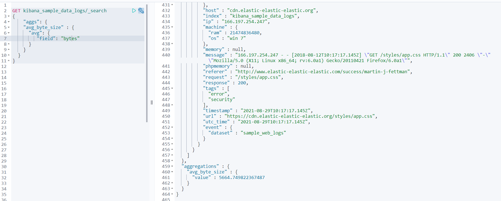

*	Find out the total number of `bytes` that only come from Windows 8 requests

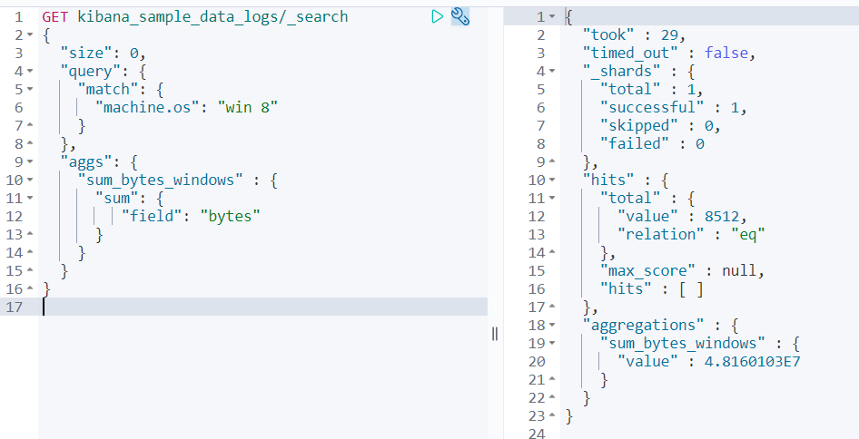

*	Find out the average number of `bytes`. Get both the aggregation and some examples of logs:

*	Get the percentiles of the `bytes` field:

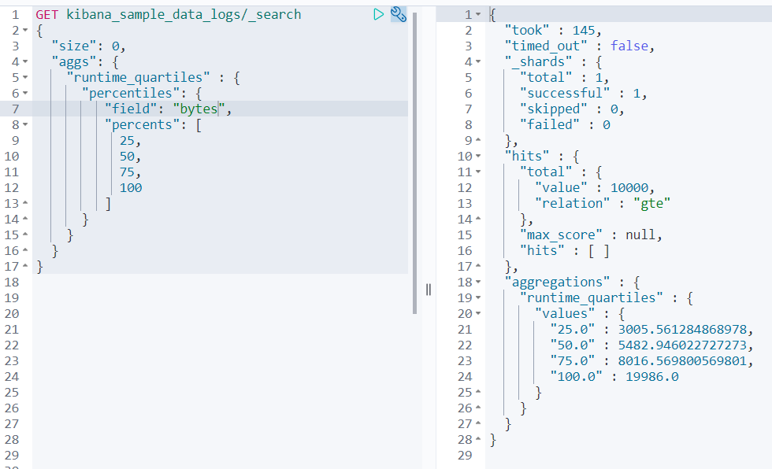

* How many different operating systems do we have in our logs?

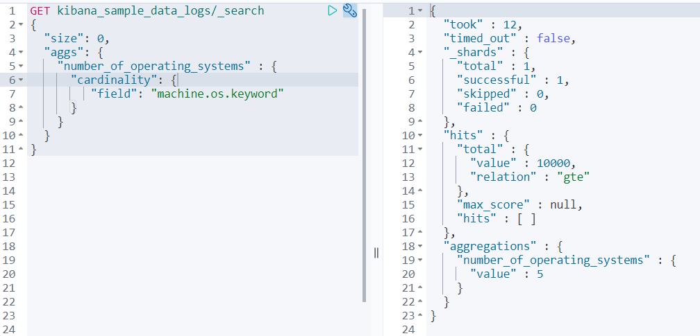

## Buckets

Aggregations:

*	Aggregate the number of total bytes per month. You can use the `timestamp` field, which is the default for aggregating with datetime-related keys

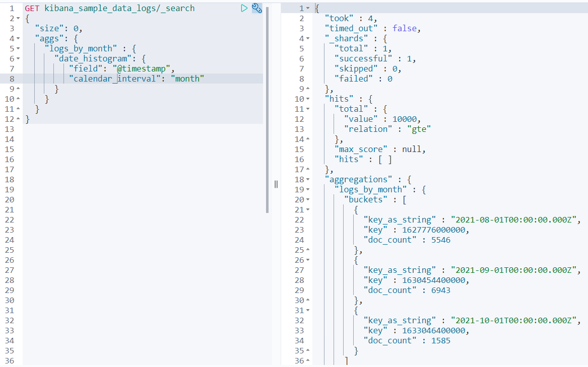

* Aggregate the total number of `bytes` by creating buckets of `2000`

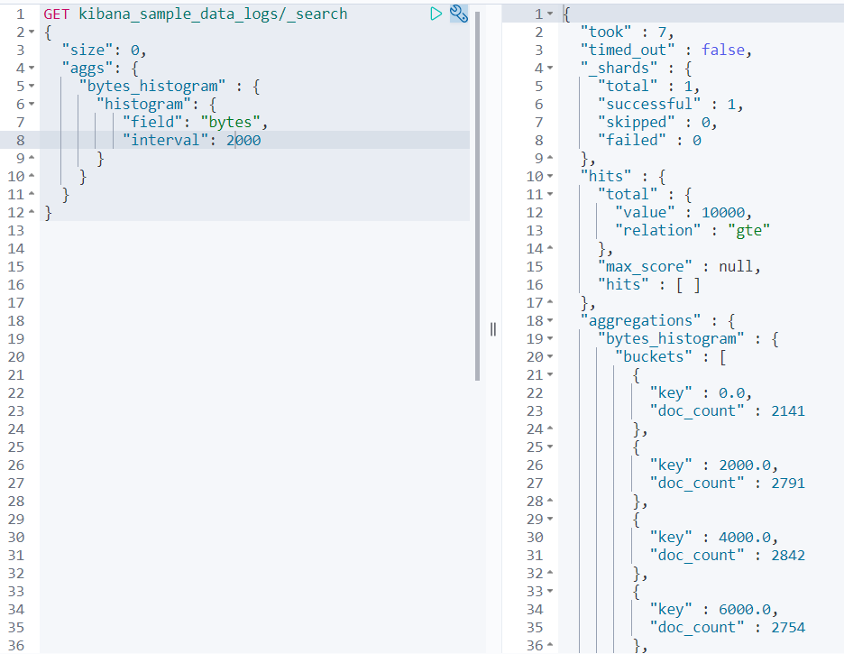

*	Again, aggregate the total number of `bytes` by creating ranges of:
  *	0 – 3000
  *	3000. – 8000
  *	8000 – 12000
  *	12000 or higher

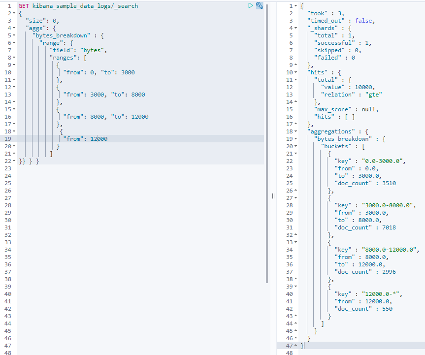

*	Aggregate the number of `bytes` per operating system:

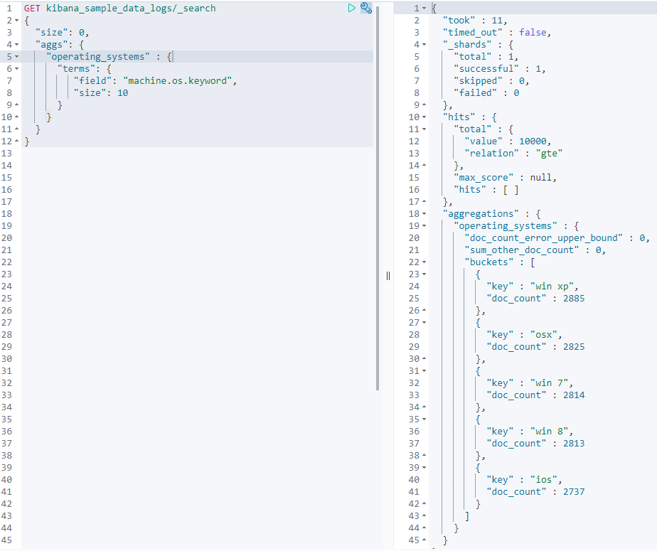

*	Aggregate the number of `bytes` per day and sort it on the largest number of bytes served on a day. 

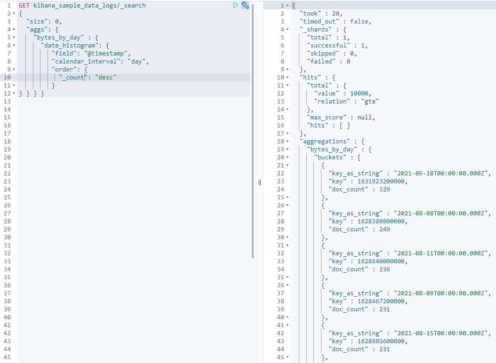

*	Execute the same aggregation, but now, sort it on the`date instead of the count

## Combined Aggregations

Combined aggregations:

*	Create an aggregation for counting the number of `bytes` per day. Order the results from the largest number of `bytes` in a day, descending order

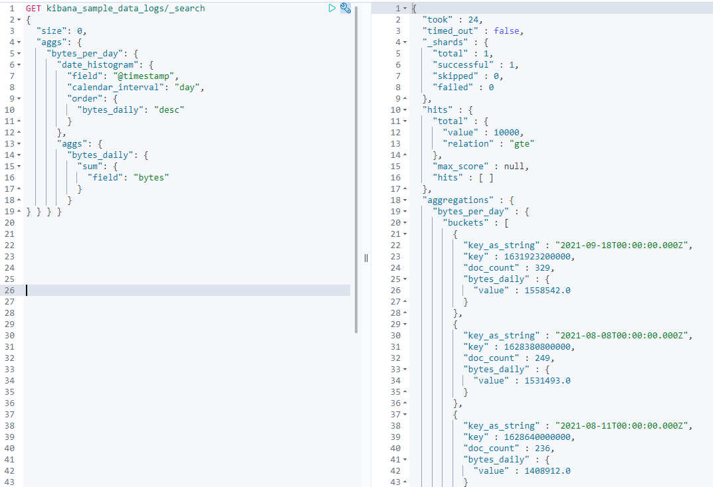

*	In the same aggregation, divide the results in percentiles of 20, 50 and 75

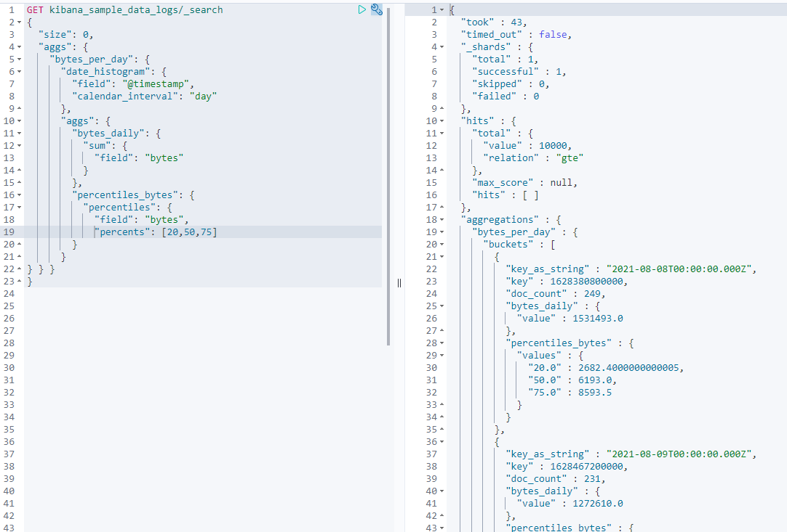

*	Create an aggregation that counts the number of log files per month. In each bucket, divide the results over the different operating systems.

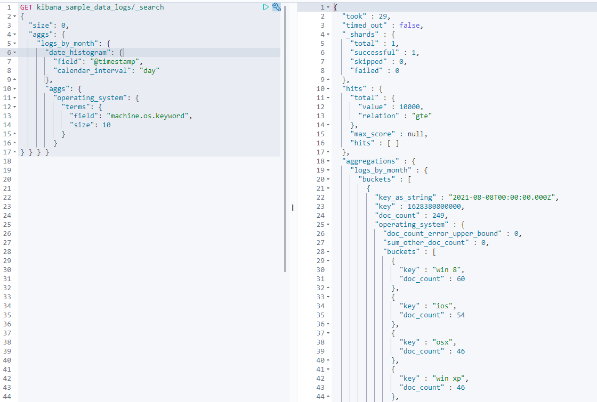

## Pagination and Pipeline Aggregations

Pagination and Pipeline Aggregations

*	Create a composite aggregation in which we have an interval of 1 hour

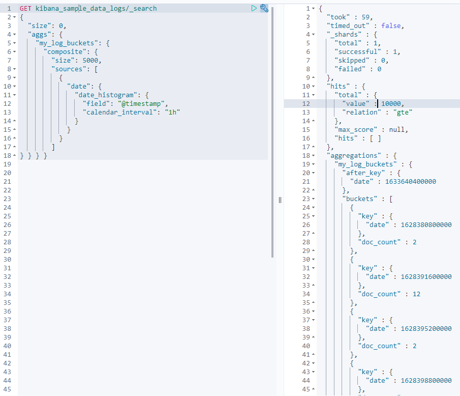

*	Create a Pipeline Aggregation which gives us the total number of bytes per month also the max month

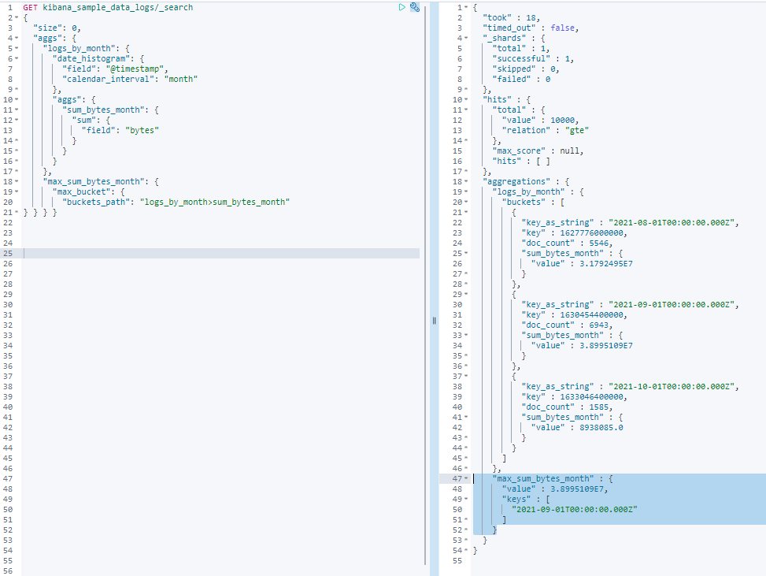

*	Create a Pipeline Aggregation in which we show the total number of bytes per month including the cumulative sum for each bucket

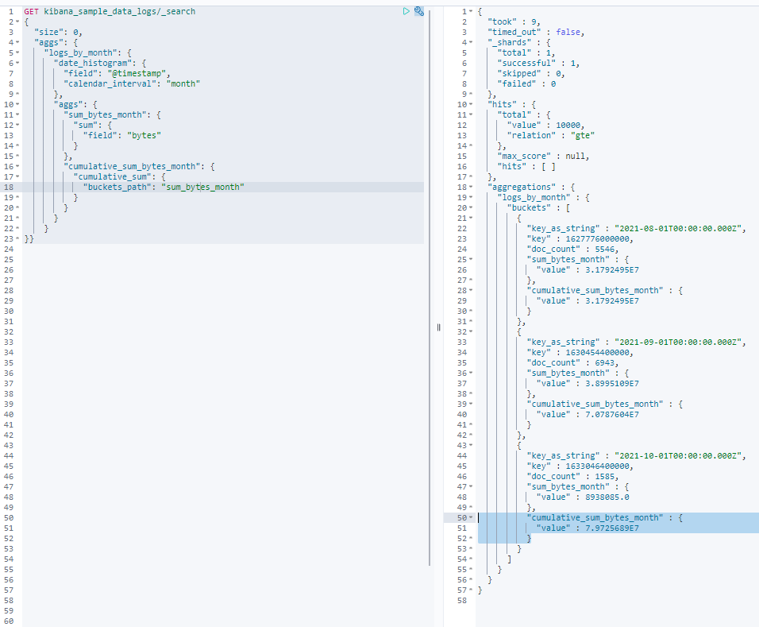

