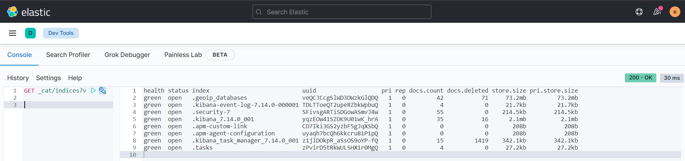
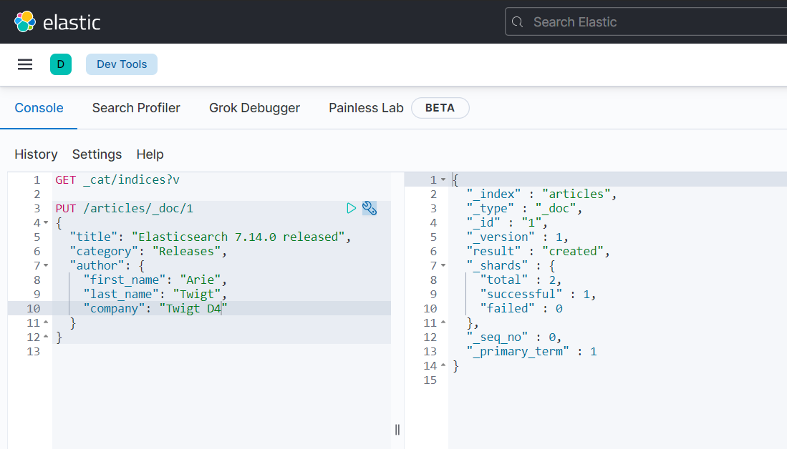
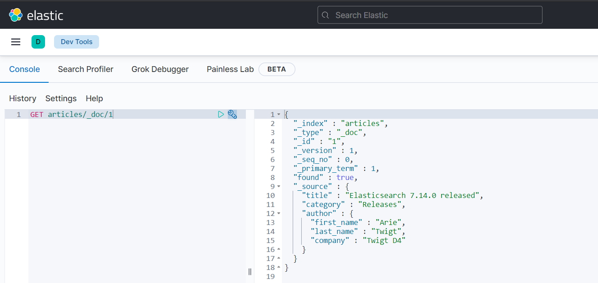
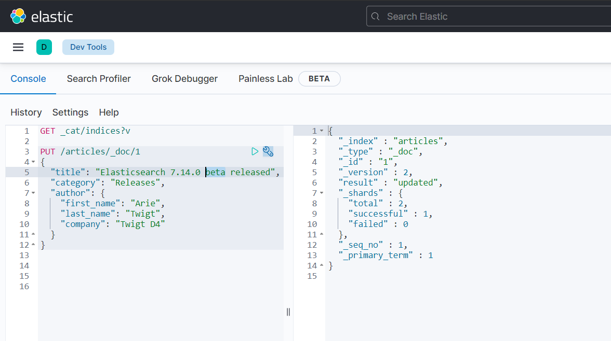
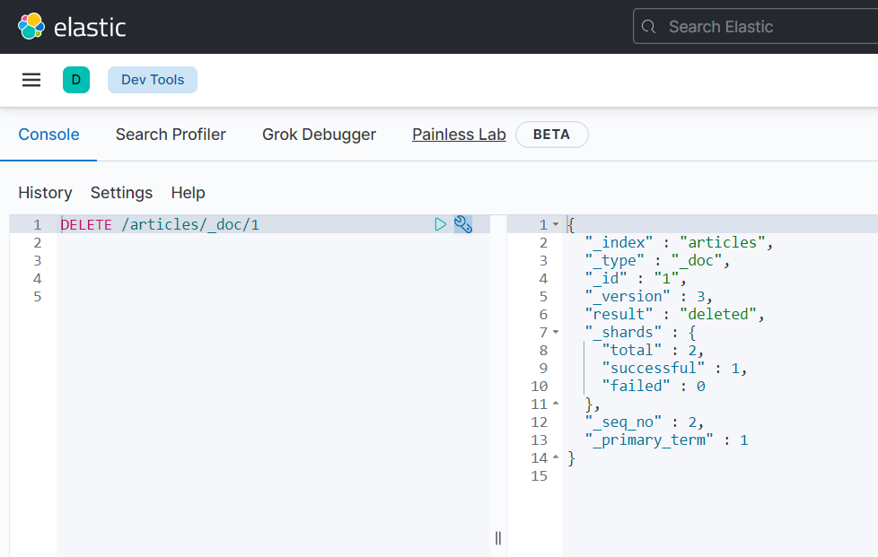

# CRUD operations in Elasticsearch

In the Kibana interface Navigate to **Dev Tools**:

*	List the current indices
  * `GET _cat/indices?v`
  

### Adding a new document

* Put a new document in a non-existing index. Insert a document similar as in the example in the left pane of the following screenshot
  *	Behind the PUT-command, we can add a document we like. Experiment with the editor to get familiar with the Elasticsearch API.
  

* Get the document:

*	Try to see what happens when you try do get the document of id 2. This document does not exist yet.
  * `GET /articles/_doc/2`

### Updating an existing document

We can also update an existing document:

*	Put a new document on the same id
*	Add a slightly change to the document
*	Find out what the output looks like:

### Deleting a document

We can also delete a document in Elasticsearch by specifing the `id` of the document we would like to delte:

*	The document is now deleted
*	Try to get to retrieve the document again, even now we have deleted it:
  *	`GET /articles/_doc/1`

We have no documents anymore, so will the index `articles` still exist? Let's find out?

*	Notice that the index still exists and even has a document count of 1 (not zero). 
* You might be in a situation in which you want to delete an index. You can do this simply by:
 *	`DELETE articles`

>	`articles` is in this case the name of the index

> **! Important**: Be very careful in deleting indices. There is no way to retrieve the data of the index back once you have deleted it. There are possibilities to enable backups, but backups are not enabled in Elasticsearch by default.

In production, it is quite uncommon to manually add documents this way. However, this is the very basic way of executing CRUD operations. 

