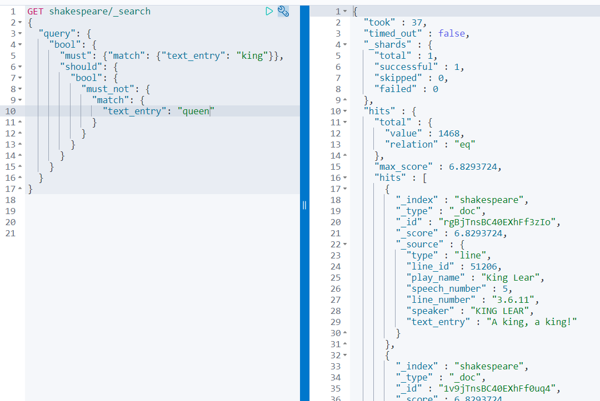

# Elasticsearch queries

## Relevance

Let's experiment with a few search queries to experiment with the relevance:

* Search for documents that have `king` or `queen` in the `text_entry` field:

* Search for documents that have `king` and `queen` in the `text_entry` field

* Search for documents that have eat least 2 of the following terms in the `text_entry` field: `king`, `queen`, `kill`:

## Full text queries

Let's experiment with some Full Text queries:

*	Search for documents that include the phrase “king and queen”:

*	Search for documents that include the phrase “king and queen” but that are allowed to have a maximum of two other terms between this phrase:

*	In the documents search for the term “Antony” in the play_name, speaker and `text_entry` fields:

* Execute the same search, but increase score of hits found in the `text_entry` by multiplying it with 4:

* Create a search query for the term “king” in which a spelling error of 1 letter is allowed:

## Combining queries

Let's experiment with some combination of queries:

*	Execute a search for documents that must include the term `king` and and are ranked higher if they either contain the terms `queen`, `fight`, or `hail`.

* Execute the same search but make sure the search results eigher must contain at least of the terms `queen`, `fight` or `hail`.

* Create a search query for documents that contain the term king but do not contain the term `queen`. 

