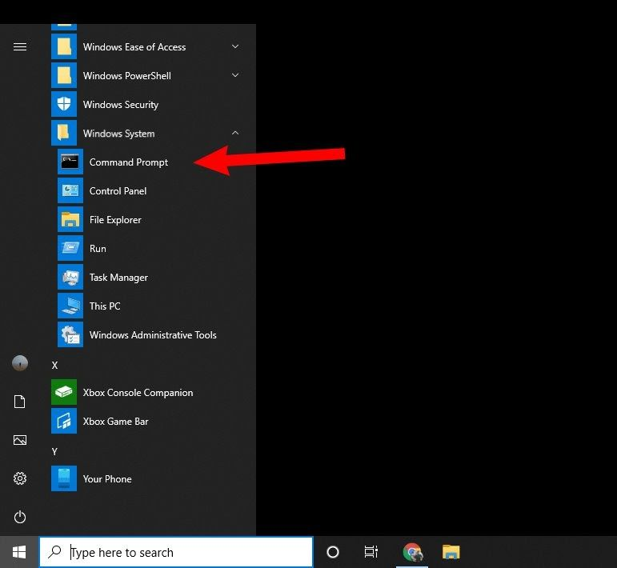
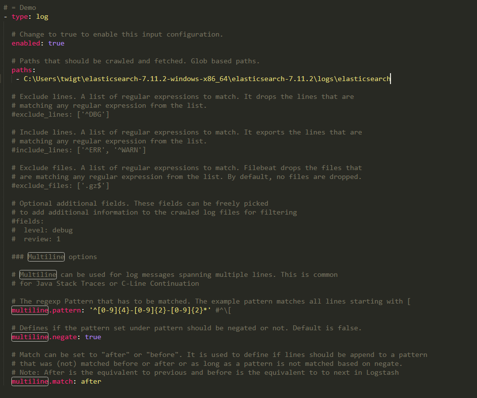
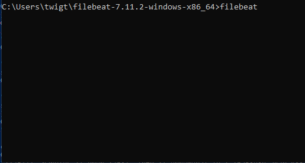
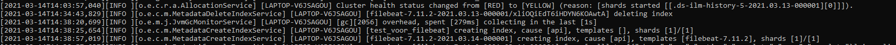
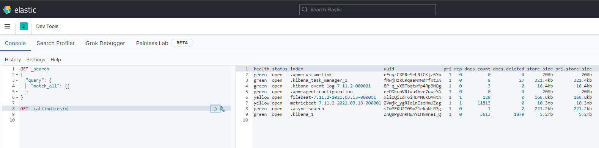

# Filebeat


In this lab we are going to use Filebeat to send logs of our running Elasticsearch to Elasticsearch. This sounds a bit confusing. 
Our running Elasticsearch instance is also logged. These logs are written to a file in our Elasticsearch directory. We are going to use Filebeat to log the content of this file to an index in Elasticsearch. Basically we are going to log our running Elasticsearch instance. 


## Configure `filebeat.yml`


Open a new Command Line while at least the Command Line windows of Elasticsearch and Kibana are running.





Navigate to the right directory containing the files and folder for filebeat.


```bat
cd filebeat-7.11.2-windows-x86_64
```


Before we start filebeat, we are going to take a look into the `filebeat.yml` file. This file contains the configuration of our filebeat instance. 


First we are going to specify a Filebeat stream in which we tell filebeat for which file to look for incoming log lines. The `filebeat.yml` file contains mainly lines that are commented out `#` to indicate that the code in that specific line is not active at the moment. 


Open this file with your favourite Text Editor whether it is in the Command Line or it is an editer like Notepad++ or Sublime Text. I mainly use the latter.


We can see these lines as templates that we can use to specify our own configurations. Let's specify a configuration for an instance in which we are going to ingest the log lines from the Elasticsearch logs file:





Let's take a look at the configuration we applied:


* `type`: As what type of data the ingested data should be interpreted. We choose for `log` since we are going to ingest log lines of our running Elasticsearch instance.
* `enabled`: The current configuration will be enabled. The logs will be ingested as soon as filebeat will be initated.
* `paths`: The path in which we can find the log lines we want to log.
* `mutiline.pattern`: The pattern that indicates a log line. With a regular expression we indicate the a `Date and Time` specification indicates that it is the start of a new log line.
* `multiline.negate`: Any line that does not match the pattern in `multiline.pattern`, is part of the previous line. In our case this is true since we want to group all log lines to the current `multiline.pattern` which is in this case a (regular expression) of a date and time.
* `multiline.match`: How filebeat will deal with  matching lines.


Next to these parameters, there are some other parameters like `exclude_files` in which we can specify which files to exclude when we specify an entire directory in the `paths` parameter. For now, we are all set with the current parameters.


We will specify/uncomment some additonal important parameters:


* `index`
    * `index`: `index: "%{[fields.log_type]}-%{[agent.version]}-%{+yyyy.MM.dd}"`
* `templates`
    * `setup.template.name`: "filebeat"
    * `setup.template.pattern`: "filebeat-*"


## Run filebeat


Now that we have finished setting up our Filebeat conifiguration, we are ready to start Filebeat. From the main directory of Filebeat.


```bat
filebeat
```





Now filebeat is running, we must wait for some Elasticsearch log lines which can be found by Filebeat and indexed in Elasticsearch. But waiting can sometimes take a lot of time, so we will make sure Elasticsearch will genereate some logs.


In Kibana open Dev Tools to access the editor. Lets put and delete an index. This will be logged by Elasticsearch. 


Add an index


```json
PUT test_for_filebeat
```


Delete tha index again


```
DELETE test_for_filebeat
```


Let's look at our Command Line in which Elasticsearch is running. The creating and deletion of the index should be logged.





In a little while, these logs will be indexed in the index we specified in our `filebeat.yml` file.


Our index starts with `filebeat`


```json
GET _cat/indices?v
```


>The logs will nog immediately be visible since the logs are not logged realtime are fetched by Filebeat for a specific time interval. Execute  the command a few times until you see the new index. If it does not appear, there might be something wrong with the configuration.





