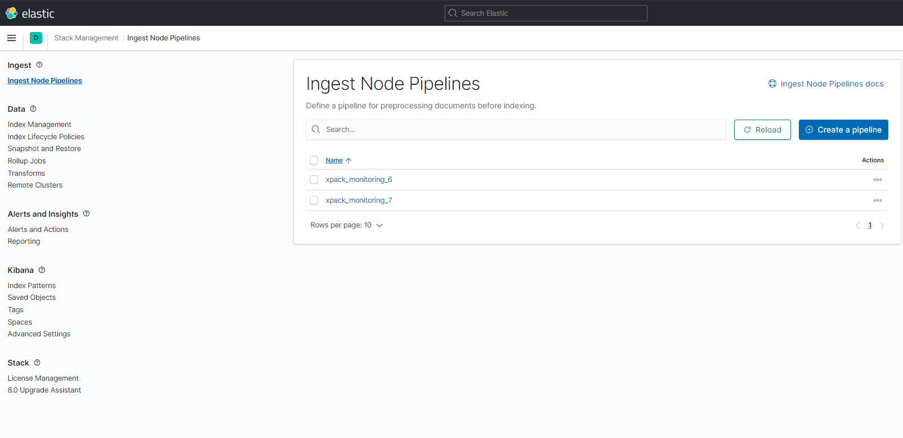
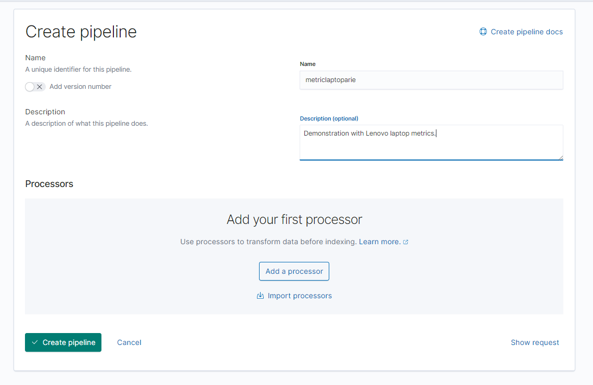
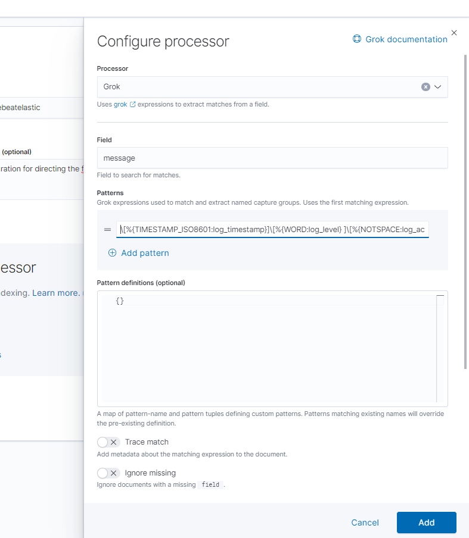
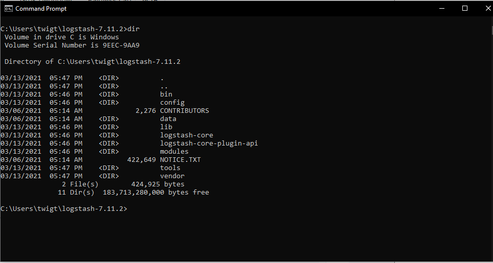
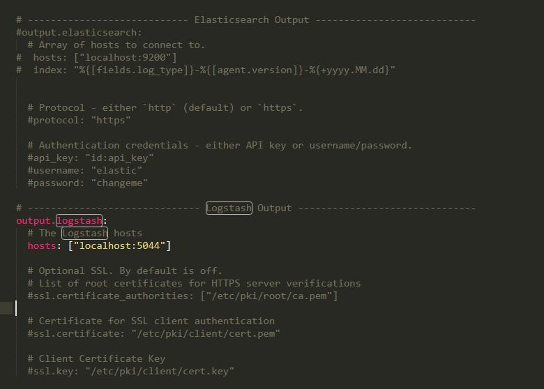
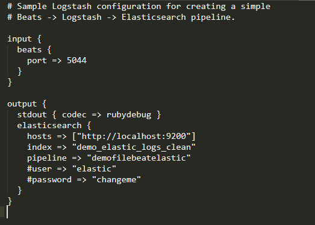
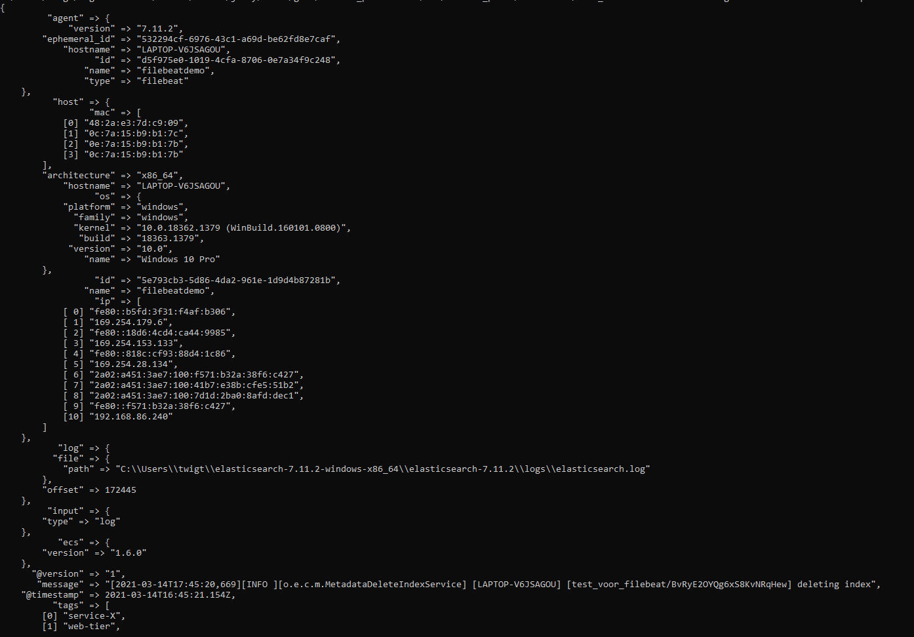
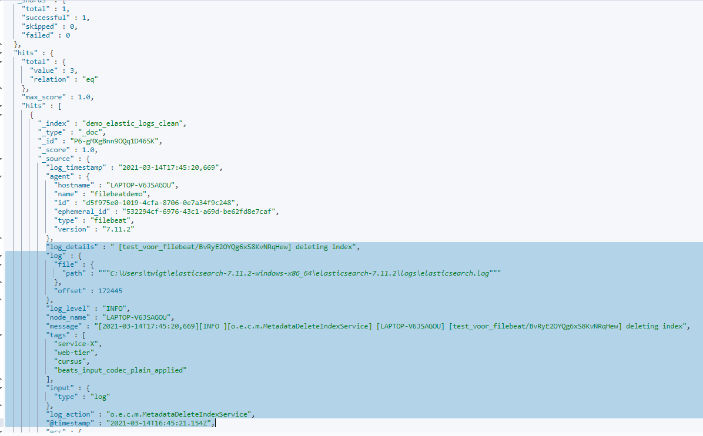

# Logstash

With Filebeat it is possible to ingest log files directly into Elasticsearch. In some situations, we want to modify the logs in different ways before it gets ingested into Elasticsearch. This is where we can use pipelines for. Logstash can be used to specify our pipelines.


## Ingest Pipelines

We create a pipeline by nagivating to the **Stack Management** page in Kibana. 

Select **Ingest Node Pipelines** in the menu.
Choose *Create Pipeline*




Give the pipeline an explanatory name:



We are now asked to configure our processor. In this section we need to specify how our pipeline will parse the log data. For this step we can use `grok patterns`. It is quite hard to figure out what our grok pattern would look like. Fortunately Dev Tools in Elasticsearch contains a debugger in which we can experiment with our incoming data to specify the right grok-pattern.


## Grok Patterns

> An overview of the grok patterns that are available out-of-the box can be found at [Elasticsearch overview grok patterns](https://github.com/elastic/elasticsearch/blob/master/libs/grok/src/main/resources/patterns/grok-patterns)


In Dev Tools open the **Grok Debugger** tab.


To experiment for the right grok pattern, we need an example log line. Copy a log line from the running Elasticsearch instance in the Command Line. For example, use the following:

```bat
[2021-03-14T15:59:16,860][INFO ][o.e.x.i.IndexLifecycleTransition] [LAPTOP-V6JSAGOU] moving index [filebeat-7.11.2-2021.03.14-000001] from [null] to [{"phase":"new","action":"complete","name":"complete"}] in policy [filebeat]
```

Paste this line in the **Sample Data** field.

Lets start with some grok patterns:

```grok
%{GREEDYDATA:details}
```

The `GREEDYDATA` pattern will take all the that from a certain point. The section after the colons `:` specifies the name of the field in which we will put this part of the log.

Lets extend the grok pattern. Take a few moments to find out how the grok pattern exactly works by trying th following patterns:

```grok
\[%{TIMESTAMP_ISO8601:log_timestamp}]%{GREEDYDATA:details}
```

Notice the importance of the position of the spaces.
The `\` indicates the `[` symbol needs to be "escaped" since it is also used in regular expressions.

```grok
\[%{TIMESTAMP_ISO8601:log_timestamp}]\[%{WORD:log_level} ]
```

Let's experiment a little further:

```grok
\[%{TIMESTAMP_ISO8601:log_timestamp}]\[%{WORD:log_level}]\[%{NOTSPACE:log_action}]%{GREEDYDATA:de_rest}
```

The end result:

```grok
\[%{TIMESTAMP_ISO8601:log_timestamp}]\[%{WORD:log_level} ]\[%{NOTSPACE:log_action}]\[%{NOTSPACE:node_name}]%{GREEDYDATA:log_details}
```

No that we have figured out the right grok pattern, we can return to the **Ingest Node Pipelines** page and continue defining our pipeline.


Select `Grok` in **Processors**
Insert `message` in **Field** since this is the original field that contains our log data.
Insert the Grok Pattern we just compoosed in the **Patterns** field.




Finish the configuration of the pipeline.

## Start Logstash


It is time to start Logstash. Open a new Command Line session and navigate to the main directory of Logstash:

```bat
cd logstash-7.8.0
```

Use the `dir` command to make sure you are in the right directory:



Let's to a little testrun for logstash with the following command:

```bar
.\bin\logstash.bat -f .\config\syslog.conf
```

In this command `.\bin\logstash.bat` indicates we want to run logstash
With the filename `.\config\syslog.conf` after the `-f` flag we specify the configuration file in which it is indicated which log-data should be ingested in Elasticsearch.

It can take a little while before we see some logs flowing trough the command line.


If the test run is succesfully executed, we are sure Logstash works. Our next step is to specify Filebeat to ingest to Logstash instead of directly to Elasticsearch.


## Specify Filebeat to ingest to Logstash


Open the `filebeat.yml` file in which we modified the configurations earlier. 

Look for the parameter `output.logstash` and outcomment it which will make it active in the configuration.

Also uncomment the line `hosts: ["localhost:5044"]`.





## Configure Logstash to ingest with a pipeline

Let's switch back to Logstash.

Getting the logs from Filebeat to Logstash is the first step. The next step is to configure Logstash how to ingest the data in Elasticsearch. 

To keep it simple, we will use the default `logstash_sample.conf` configuration (full path from the main Logstash directory is: `.\config\logstash-sample.conf`).


Check out the `logstash-sample.conf` file.

The `input` section specifies where Logstash will look for data, which is in this case Filebeat.
Next, `output` specifies how and where the data will be ingested.

This output has several fields:

* `stdout`: How would we like to display the progress of the logs that are being ingested by Logstash. With the option `rubydebug` we will see the all the raw files (in the command line) that are being ingested in Elasticsearch
* `elasticsearch` We specify that the logs will be ingested in Elasticsearch
    * `hosts`: The location of Elasticsearch, which is in this case our instance running locally.
    * `index`: The name of the index the data will be ingested. If this index does not exist yet, it will be created automatically.
    * `pipeline`: This is an important step. In the previous section, we have defined our pipeline with the right grok pattern for ingesting the logs in Elasticsearch. In this parameter we need to specify the name of that pipeline.
    





Now that we have our Logstash configuration file setup, we are ready to start Logstash to ingest the logs ingested by Filebeat.

First we start filebeat (if we still have a Command Line window open with Filebeat )

```bat
filebeat
```

In the command line in which we have Logstash, we will start our Logstash instance with our configuration.

```bat
.\bin\logstash.bat -f .\config\logstash-sample.conf
```

The startup of Logstash will take little while. 

> It is important that Filebeat is running while we have Logstash running. Otherwise there is no data to be ingested.


As soon as Elasticsearch will generate some logs, we will see them flowing through our Logstash instance.




## Check the data from Logstash in Elasticsearch

When our Logstash instance is running, busy ingesting the logs that are being ingested by Filebeat, we can take a look at the data in the new index that we have specified in the Logstash configuration.

In Kibana open Devtools en check if our new index is visible.


```json
GET _cat/indices?v
```


If the index is visible, we can view what a document in this index looks like. It should match the way we specified it with our grok patterns.

```json
GET demo_elastic_logs_clean/_search
{
  "query": {
    "match_all": {}
  }
}

```




Voila! 