# Nodes and Shards

## Running a multi-node cluster

In this example we will run multiple elasticsearch instances on your local computer. In terms of limited resources, in the examples we will stick with 2 instances. We will achieve this by “creating” another Elasticsearch instance. 

For this lab, close both Elasticsearch and Kibana if these are still running in the Command Line

## Adding a second Elasticsearch node locally

Execute the following steps in your explorer:

*	Open an **Explorer** (Windows) or **Finder** (Mac) tab on your machine.
*	Create a new directory called `es_nodes`. This directory could have any name, but this is quite descriptive for now
*	Drag the .zip file with the fresh Elasticsearch instance in the es_nodes directory.
*	Rename the .zip file to `elasticsearch_2`. Also this is descriptive enough for now.

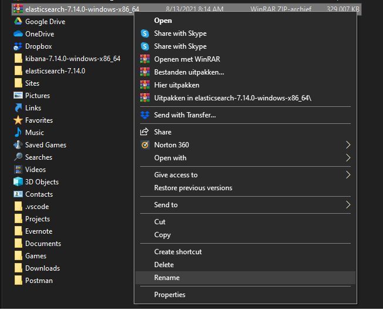

* Extract the zip file
*	Your should now have the following setup:
  *	A directory called es_nodes in your **Home Directory**
     *	In the `es_nodes` directory an instance of Elasticsearch extracted.
     *	Optionally you still have the .zip file. You can either leave it or delete it since we do not need it anymore from now on.

     
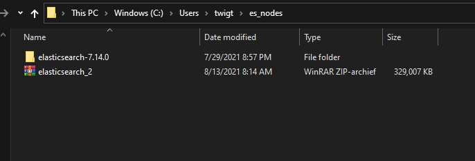

## Configure the Elasticsearch nodes for the multi-node cluster

Now that we have a “second Elasticsearch” instance, we need to make sure the configuration for both instances is ready to form a 2-node Elasticsearch cluster.

Since we now have 2 nodes, we have two locations in which we can set the configuration. The changes we are going to make in our configurations involve:

*	Make sure both nodes are assigned to the same cluster
*	Set or change the names of each node
*	Indicate if the node is a master not or not
*	Specify the network host
*	Specify which other networks to discover
*	In both nodes, indicate which node is the master
*	Change the security settings

> It might be needed to change the memory settings for the multiple Elasticsearch instances. For both instances, we can change the settings in the config/jvm.options file. For example, we can lower the memory from 4 GB to 2 GB ram by uncommenting and changing the values in the settings.

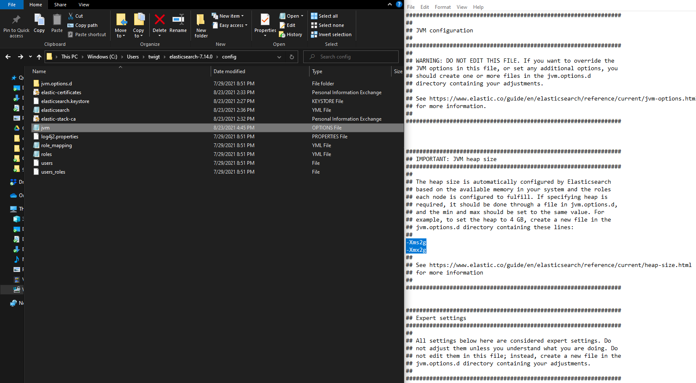

## Configure the cluster value and set the names of the nodes

On the first node, which is the first and initial Elasticsearch instance we configured, make sure you have the following settings:

`elasticsearch.yml` (first node):

*	`cluster.name: es-training-cluster`
*	`node.name: node-1`
*	`node.master: true`

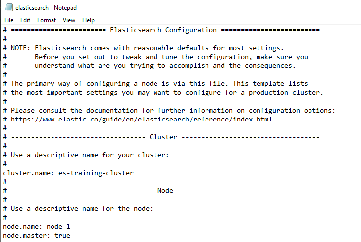

`elasticsearch.yml` (second node):

-	`cluster.name: es-training-cluster`
-	`node.name: node-2`
-	`node.master: false`

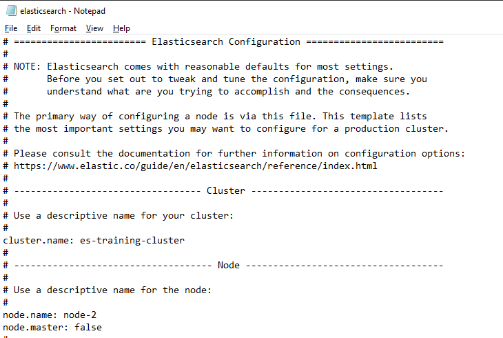

By editing these configurations, we indicated in both nodes to which cluster they belong to, what the name of the node is and if the node is a master-node or not.

## Specify the network settings and indicate which node is the master

Next, we need to configure settings about the network to discover. On that network the node will search for a cluster (Elasticsearch instances with only a single node are also considered a cluster). 

Since we have both these instances running locally, we can specify the value of the network of the machine. The settings must have the same values on both nodes. Therefore, in the configuration files of both the first and second node set or change the following configuration options:
  
`elasticsearch.yml` (both nodes):

-	`network.host: 0.0.0.0`
-	`discover.seed_hosts: [“127.0.0.1”]`
-	`cluster.initial_master_nodes: [“node-1”]`

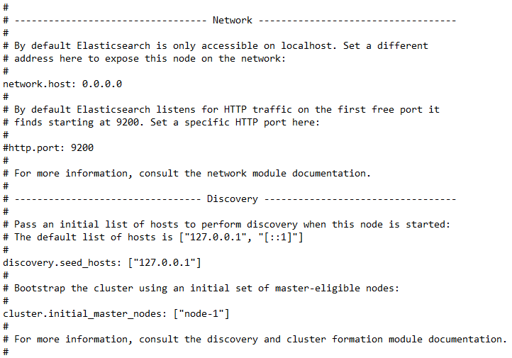

## Change the security settings

Since HTTP is used in Node-to-Node communication, it is strongly recommed that in production both security and encryption is enabled. For now, since we focus on having our first multi-node cluster up and running and are not running in production, we leave these security steps for now. 

In both nodes, for now, disable the security settings by adding a command (`#`) symbol in front of the configuration setting or delete the entire line. We can add it again when we want to proceed with our single node or when we have the additional settings enabled.

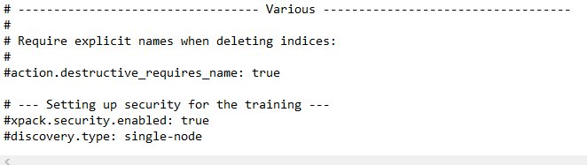

Make sure you have saved the configurations all the nodes.

## Start the multi-node cluster

Now we have changed the configuration for both our nodes, we will start our cluster. If you haven’t done it yet, close both all the Elasticsearch and Kibana instances:

*	Start the first, master, Elasticsearch node
  *	In the Command Line navigate to the Command Line and execute `bin\elasticsearch`
*	During the startup, it will indicate that it is the master node of the cluster

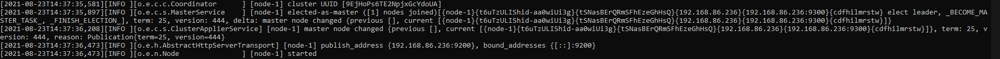

When the first node is started, we can launch the second node:

*	Start the second,Elasticsearch node
  *	In the Command Line navigate to the Command Line to the second Elasticsearch instance which we have called es_nodes.
* 	execute `bin\elasticsearch`

We currently have two Command Line windows open. After the startup of the second node is complete, it tries to look for other running instances on the same network. When the second node has found the already running instance, it will join the cluster as the specified role.

*	Try to locate the following log line in the second Elasticsearch instance:

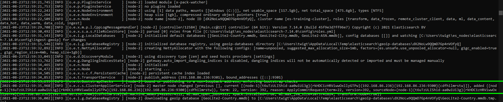

This log message indicates it hast joined the `es-training-cluster` cluster and recognizes that the first node, Node-1, is the master of this cluster.

If we open the Command Line in which the first instance is running, we will notice a log line that indicates another node has joined the cluster.

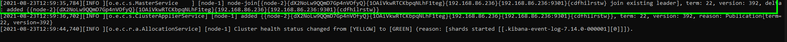

We have now successfully launched a two-node Elasticsearch cluster locally on our machine.

We can check for both nodes if they are running by navigating both to:

-	[localhost:9200](localhost:9200)
-	[localhost:9201](localhost:9201)

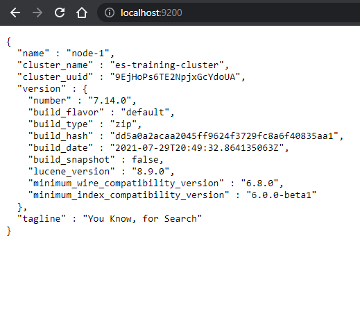

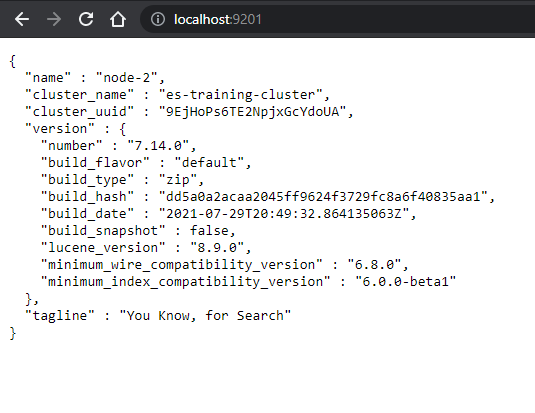

## Check out our cluster in Kibana

We can open Kibana the same way as was the case when we still had a single node cluster:

*	Open a new Command Line in which we launch Kibana
*	When Kibana is fully started, navigate to the Kibana interface at [localhost:5601](localhost:5601)

Let’s checkout out the settings of our cluster:

*	In Kibana, navigate to the **Dev Tools** pane
*	We can get an overview of the cluster settings by inserting a query:
   *	`GET _cluster/health`

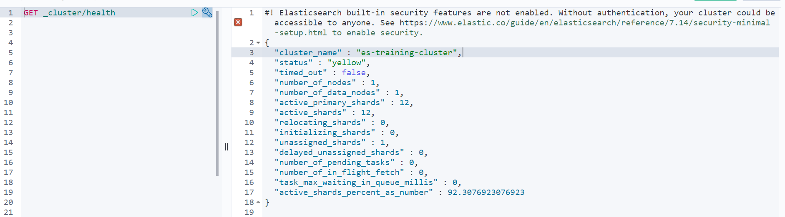

## Cluster roles

Change the settings of the cluster which makes only Node 2 the ingestion node:

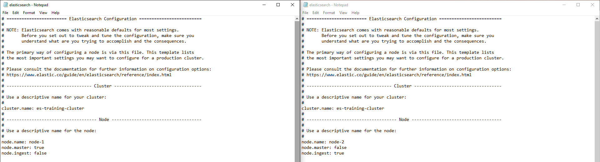

