# Searching for data

In the labs, we are going to use two different types of sample data sets:

*	Dynamic datasets
*	Static datasets

## Loading the Dynamic Dataset

The Dynamic Dataset can be loaded in the Home page of Kibana
-	In the Home page of Kibana, click for the little Try our sample data line

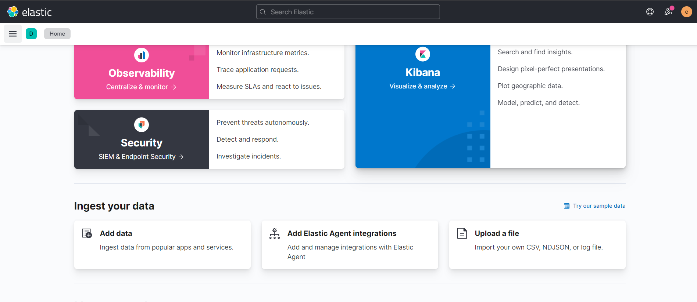

*	Select the ***Sample web logs*** dataset. Click Add data
*	It will take a few moments, when the data is successfully loaded, the button changes in View data

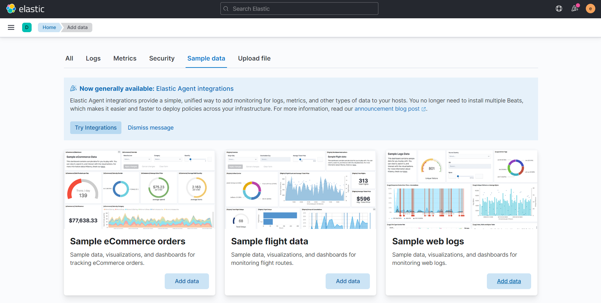

*	You are finished for now, the next step is to add the static data

## Loading the Static Dataset

For the static data, we are going to experiment with the Upload file option. This way we can use file from our computer to index in Elasticsearch. We are going to upload Shakespeare documents as examples for our static data:

*	Download the Shakespeare dataset [https://download.elastic.co/demos/kibana/gettingstarted/shakespeare_6.0.json](https://download.elastic.co/demos/kibana/gettingstarted/shakespeare_6.0.json) .
*	In the Add data page, choose the Upload data tab
*	Click the ***Select drag and drop a file*** button, or drag the file into this area
*	Kibana will process the file and provide a summary of the dataset that will be uploaded. In this phase you can modify several settings for the index that will be created. 

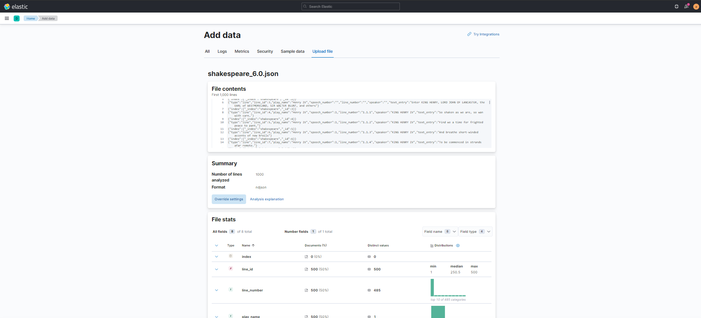

For now, we will only change the name of the index that will be created for the contents of this file. Change the name to `shakespeare`.

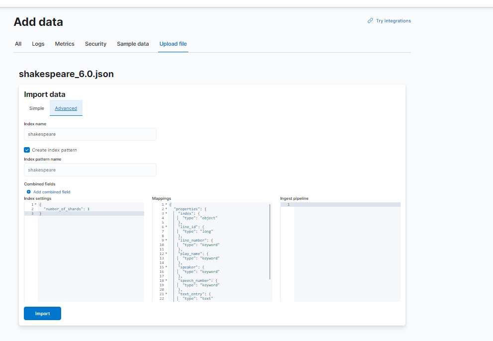

* Now the name is changed, click **Import**

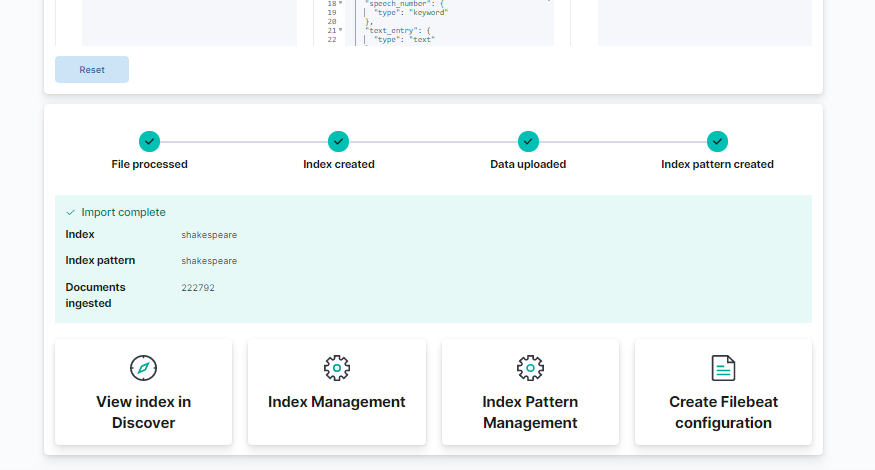

*	By importing the file, Kibana will go through several phases of the import process. When these phases are completed, the data is successfully uploaded in our Elasticsearch cluster.
*	Next, we will get back to Dev Tools to see if our two new indices are visible:

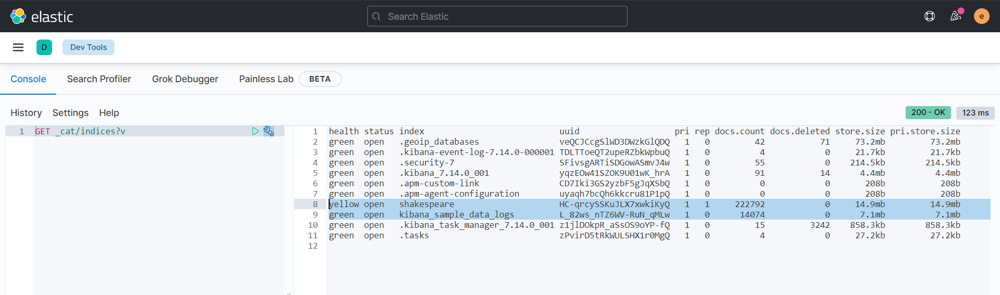

*	Just like in the previous screenshot, your indices with sample data shoud be available now. 

## Search in Elasticsearch

### Search in Static Datasets

Search is mainly executed on static datasets. In this case, we will use the `shakespeare` dataset that we have imported in our Elasticsearch cluster in the previous step:

We will start with a simple match-query in our shakespeare index:

*	We can get information about the index by checking out the mapping. This way we will get an idea of the fields we can use for our search queries

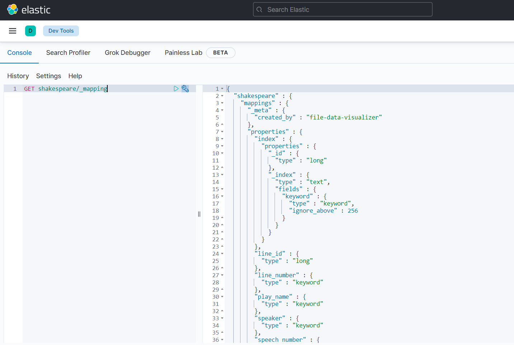

*	Notice that in Dev Tools you have auto-completion to help you construct your request:

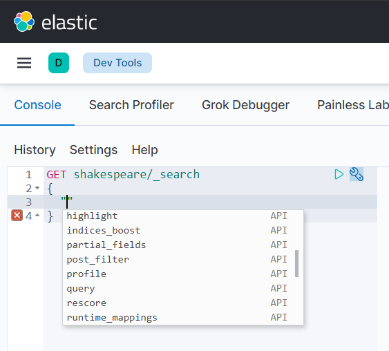

The auto-completion in Dev Tools helps you suggest the right options at the right place in the query:

* To get an idea, we can get the mapping of an index in our Elasticsearch cluster:
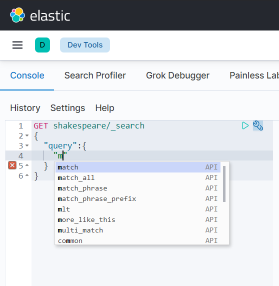

* Another way to get an idea about a document in our index, requesting some random documents:

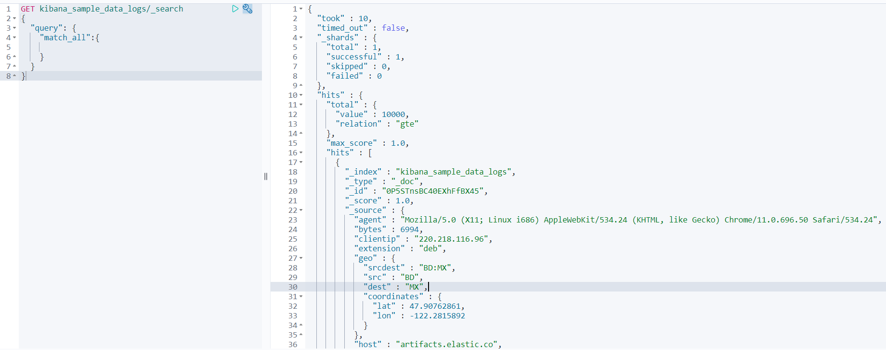

Let's try out some different search queries:

* Match any document with the play name "Henry V"

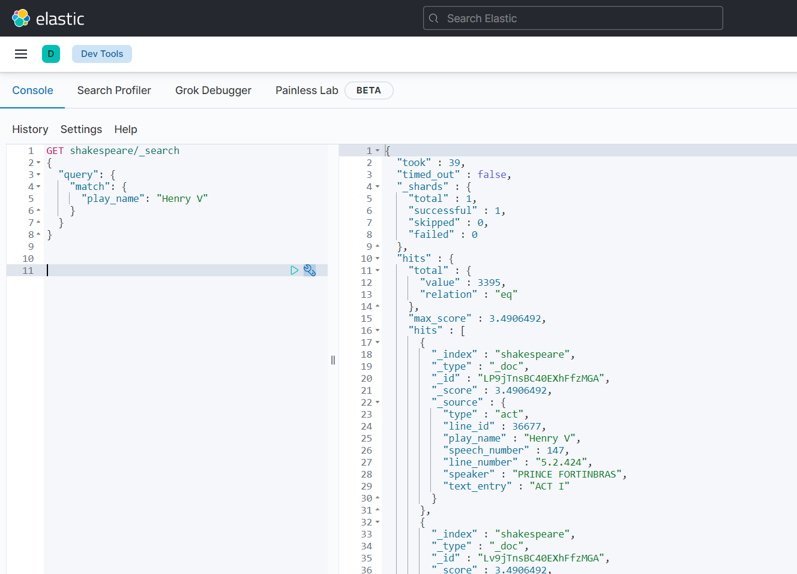

* Get all documents with `speech_number` lower than or equal to 10:

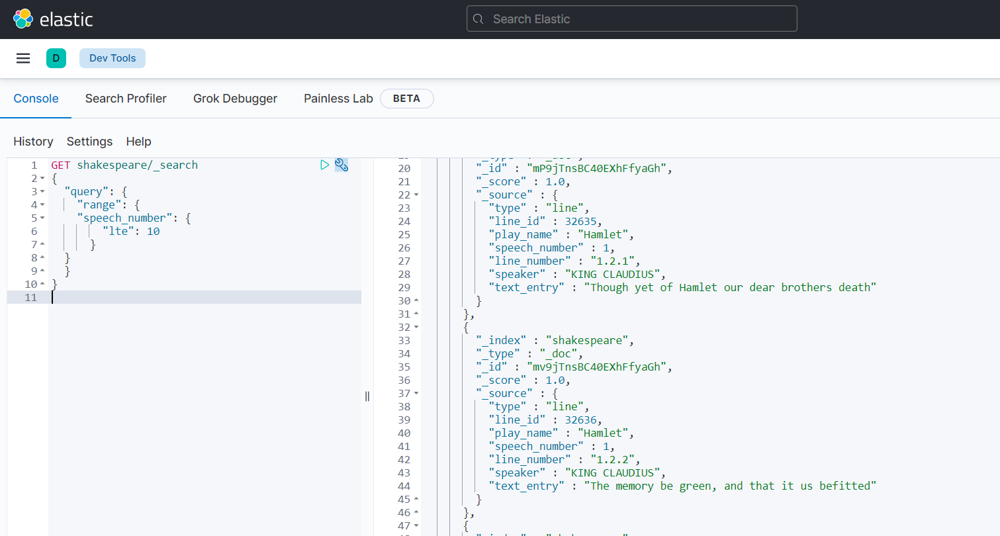

* Get all documents in the shakespeare index with speech number between 10 and 20 (including 10 and 20)

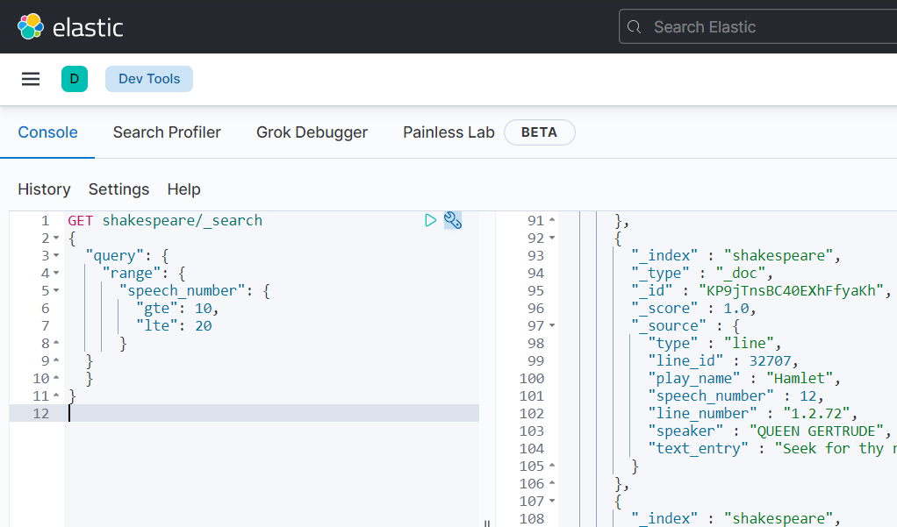

* Get all documents from the shakespeare index from the play name Hamlet between line number 1 and 2 (greater and equal to and lower and equal to)

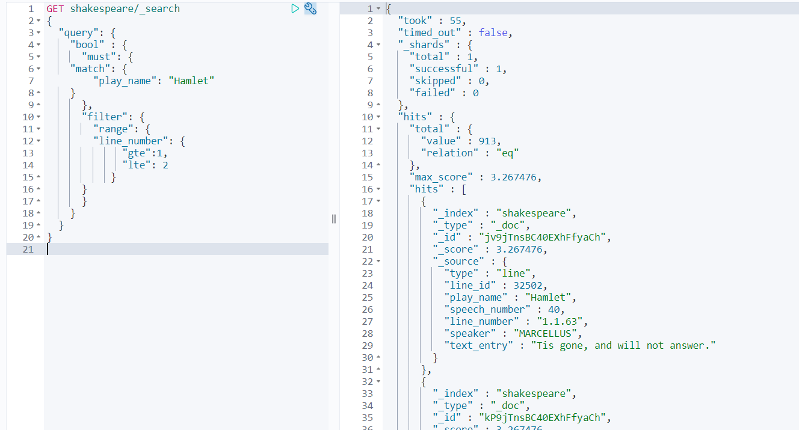

