# Setup for Elasticsearch version 7

## Download Elasticsearch

### Download and unzip the Elasticsearch installation in your Home Directory

Download Elasticsearch by visiting the following url:

[https://www.elastic.co/downloads/elasticsearch](https://www.elastic.co/downloads/elasticsearch)

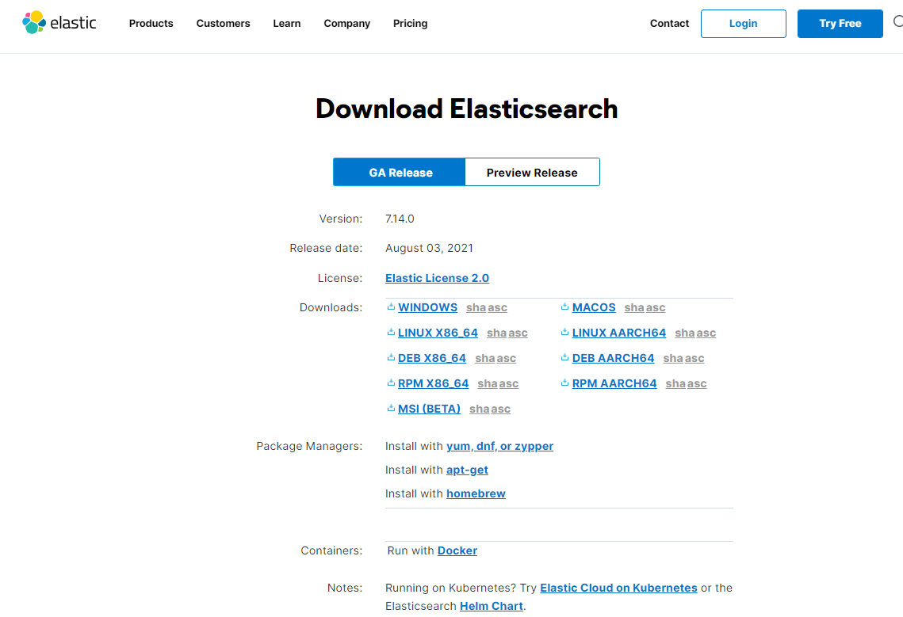

Choose for **Windows** rather than for the MSI. We are going to place and extract the file in our *Home Directory*: 
> Your Home Directory is for example: *This PC > Windows (C:) > Users > arie* . This is the folder in which you typically can find folders like *My Documents*, *Downloads*, *Dropbox* etc.

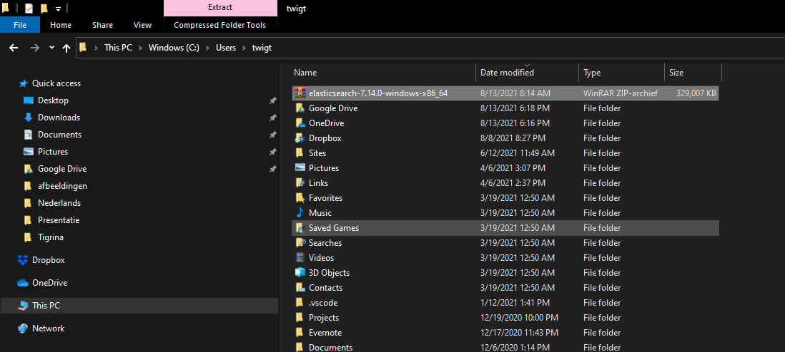

Unzip the folder and extract it in the same directory. This is most likely the default option for unzipping the file:

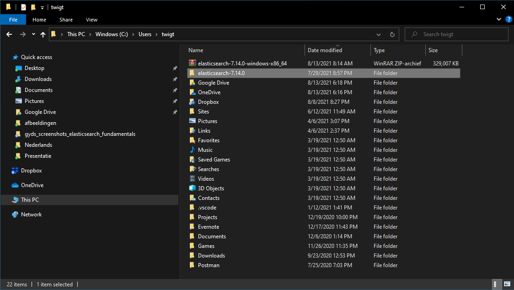

### Start Elasticsearch from the Command Line

Now we have downloaded and extracte Elasticsearch, we can launch it from the command line:

* Open a new command line. This can be for example **Command Prompt** or **Powershell**
* In the command line, navigate to your Home Directory where your Elasticsearch instance is stored

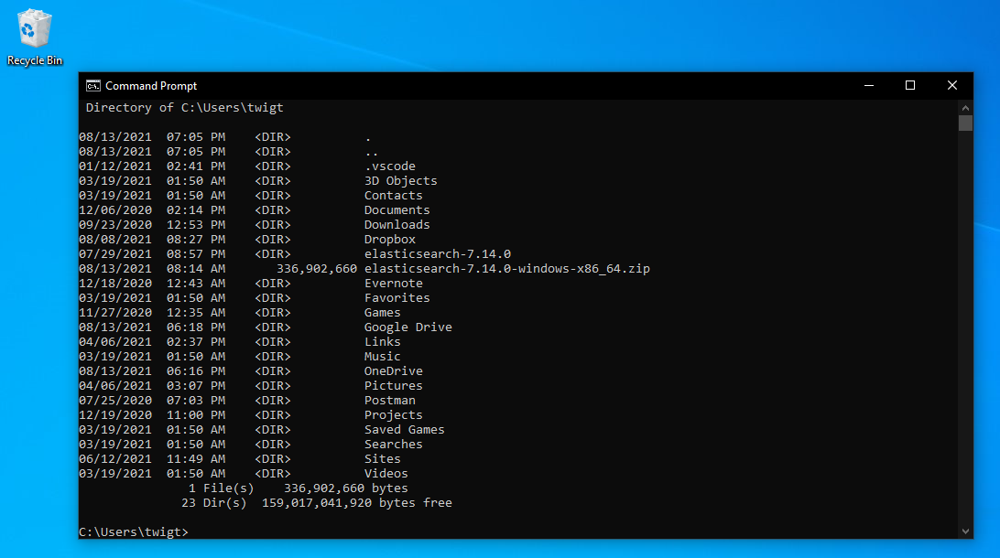

* If the Elasticsearch directory is present, navigate into it. In the following example, we have downloaded Elasticsearch **7.14.0**, so the commands would be:
   * Navigate into the Elasticsearch directory `cd elasticsearch-7.14.0`
   * Start Elasticsearch `bin\elasticsearch`
* The `bin\elasticsearch`, if in the right folder, will launch the Elasticsearch instance

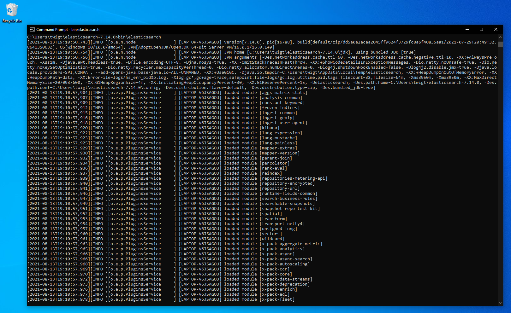

* We need to wait a minute or so before Elasticsearch is fully booted. To find out if Elasticsearch is succesfully booted, we can open a browser and navigate to [localhost:9200](localhost:9200).

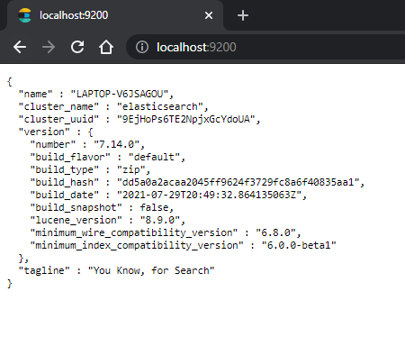

Checkout the output and the name of your cluster. By default this will similar to the name of your computer.

### Changing basic settings in the Elasticsearch configuration

Later in this course, we will change the configuration of the Elasticsearch instance. In this section, we will start with modifiying some basic settings in te configuration. We will start by chaning the name of the cluster.

> An Elasticsearch "cluster" is a collection of hardware that is operates as one Elasticsearch instance. Elasticsearch instances that consist of only one Node (machine) are also referred to as a "cluster". Later in this course we will run a cluster that runs on multiple nodes.

Change the default name of the Elasticsearch cluster:

* In the Command Line, close the running Elasticsearch instance
* Run Elasticsearch with a different node name and cluster name:
   *	`bin\elasticsearch -E node.name=my_node -E cluster.name=my_cluster`
*	Wait until Elasticsearch is fully started
*	Check the output of the browser

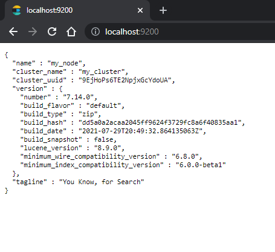

There is another, more sustainable, way of specifying the configuration of an Elasticsearch instance:

* Open your Explorer and navigate to the `config` directory which can be found in the Elasticsearch directory
  * In this screenshot, for Elasticsearch version 7.14.0 this is *Elasticsearch-7.14.0 > config > elasticsearch.yml*

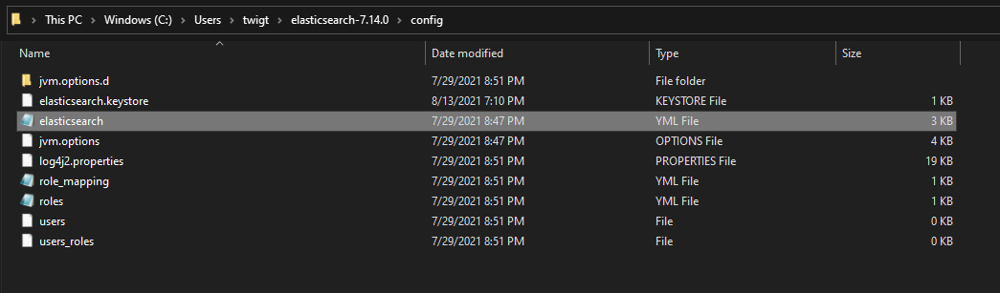

*	You can open the `elasticsearch.yml` file with Notepad. Uncomment, which is removing the `#`, in the line in which the `cluster.name` property is defined. Change the default name to descriptive name you desire. In The case of this example, we have named it `es-training-cluster`.

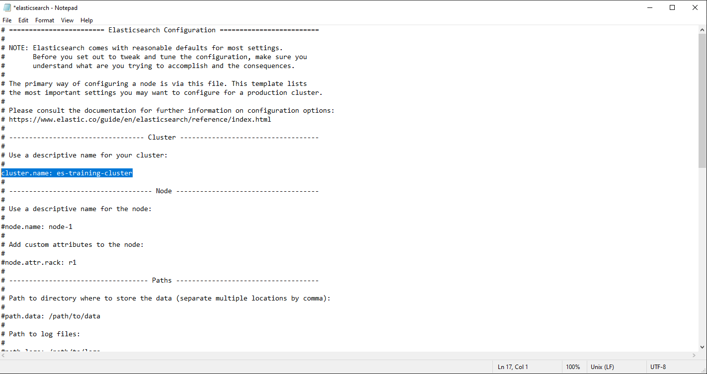

*	Save the `elasticsearch.yml` file
* If you did not have already done this, stop the running Elasticsearch instance in the command line.
* Start Elasticsearch again just with the regular command `bin\elasticsearch`

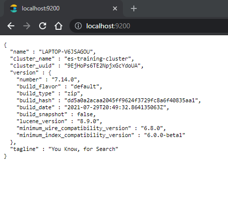

> Keep in mind that in a real-world environment, the running Elasticsearch instance can be set as a service. It keeps on running this way. In this training we will simulate this by keeping, sometime multiple, instances of the Command Line open.

## Getting started with Kibana

### Interacting with Elasticsearch

There are several ways to interact with our running Elasticsearch instance:

*	Using curl operations from the Command Line
*	Sending HTTP requests using the Elasticsearch API in a tool like Postman
*	Using the Dev Tools in Kibana

### Managing Elasticsearch in Kibana

In this course we choose for the last option since we will be able to execute other actions in Kibana as well. Therefore, we first need to download Kibana

[https://www.elastic.co/downloads/kibana](https://www.elastic.co/downloads/kibana)

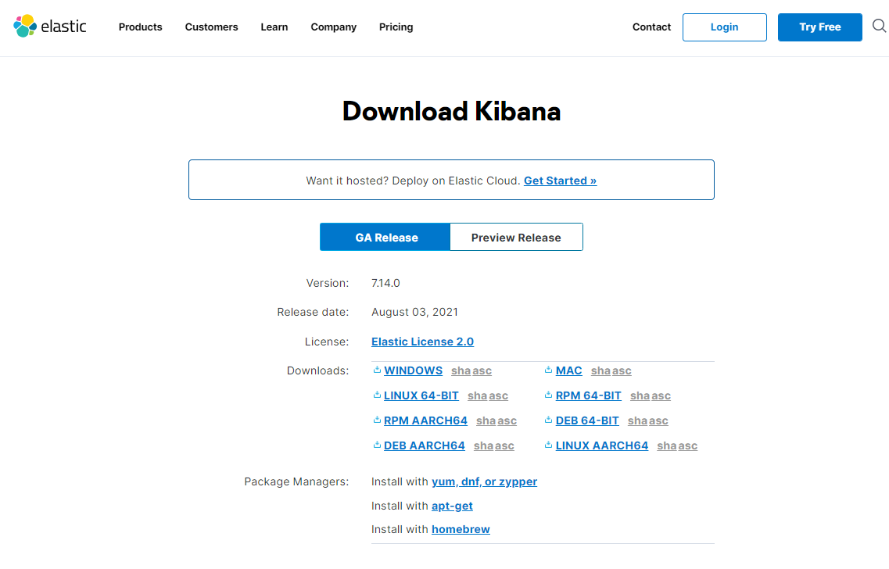

### Downloading and extracting Kibana

Downloading and setting up Kibana is similar to the steps we executed for Elasticsearch:

*	Choose for your operating system, which is in the case of our examples Windows. 
*	Just as with Elasticsearch, make sure to move the download from your Downloads folder to your Home Directory.
*	Also, just like Elasticsearch, extract the contents of the zip-file

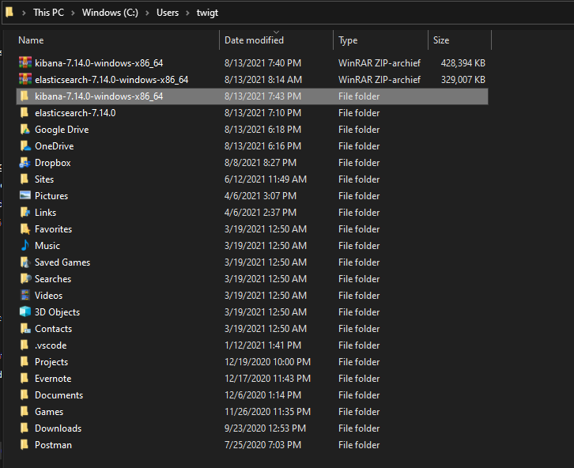

### Launching Kibana

*	Open a new Command Line and navigate to the Kibana directory.
  *	`cd kibana-7.14-windows-x86_64`
  
> For convenience you can change the name of the directory by removing the `windows`part

*	Start Kibana
  * `bin\kibana`
  
*	After a minute or so, Kibana is started. You can use Kibana by navigating to [localhost:5601](localhost:5601) in your browser.

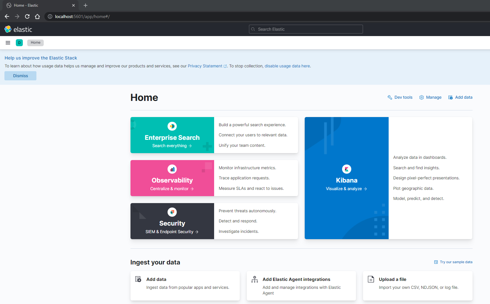

### Using Dev Tools for CRUD-operations in Kibana

Now we have started Kibana, we can use the Dev Tools to execute CRUD-actions to Elasticsearch:

* In the Left Pane scroll down to find the `Dev Tools` tab

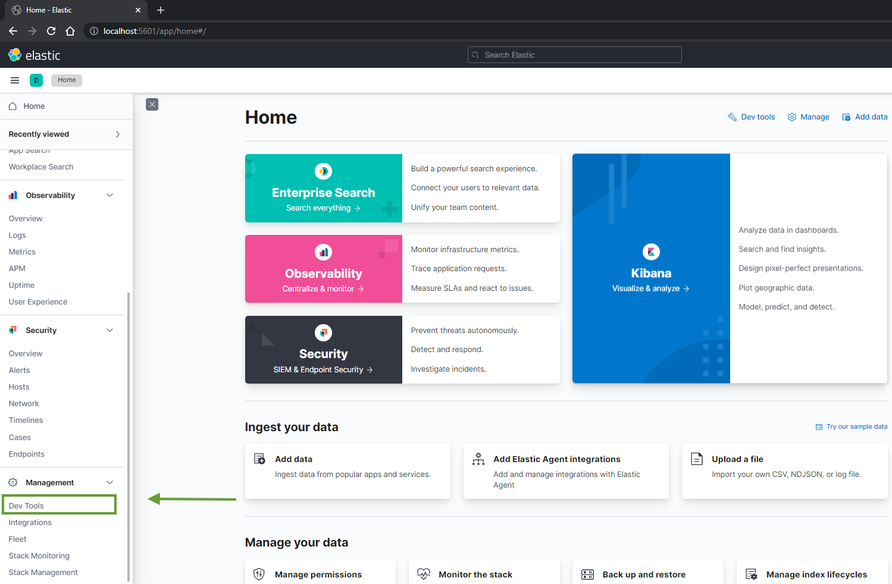

In the Dev Tools tab we can execute several operations in Kibana, also CRUD-operations. First we will use a command that lists all the current indices in Elasticsearch:

*	`GET _cat/indices?v`
*	Press the play button to execute the command

We will get a list of *indices* in Elasticsearch. These indices are available by default. These are default indices that have mostly to do with logging and administration.

We also notice a message about setting up security. This will be our next step.

Kibana is working now, however, it is not secure yet. When you are following these labs on your local machine, this is not quite a big deal. However, when you are planning to configure Elasticsearch on a server that is reachable for other users, you do want to have at least the basic security setup. Otherwise, just anybody can log into your Elasticsearch cluster and Kibana and even modify settings or documents.

In the next step, we are going to setup basic security for Elasticsearch and Kibana.

## Setting up basic security for Elasticsearch and Kibana

Setting up the basic security settings for Elasticsearch and Kibana is a combination of command line operations and settings in the configuration files of both Elasticsearch in Kibana:

### Enabling X-pack security

*	Stop the currently running processes of Kibana and Elasticsearch
*	In the configuration file of Elasticearch, 
*	We are going to add two settings to our Elasticsearch configuration
  *	`xpack.security.enabled: true`
  *	`discovery.type: single-node`
  
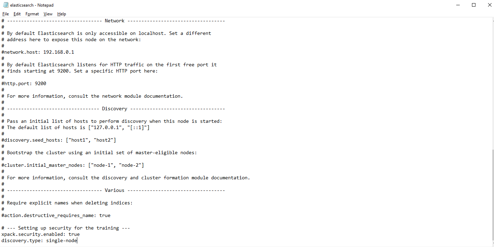

*	Save the configuration file

### Setting up passwords

We are now going to open 3 Command Line Windows:

1. One for running Elasticsearch
2. Another one for running the password setter in Elasticsearch
3. The third for the password settings in Kibana. This third command line will be opened in the next session.

* (1) Running Elasticsearch:
  * Open a new Command Line
  * Navigate to the Elasticsearch folder and start Elasticsearch:
     * `bin\elasticsearch`

*	(2) Running the Elasticsearch password setup
	* It might be needed to wait a little while until Elasticsearch is fully started
	* Open a new, second, Command Line while keeping the other Command Line with Elasticsearch running open.
	* Navigate to the Elasticsearch folder and start the password setup:
    * `bin/elasticsearch-setup-passwords auto`
    *	We choose for the auto option which automatically generates a random, strong, password that will be stored in our installation.
    * **! Important**: Make sure you remember the password for both kibana_system and elastic. Save these credentials in a temporary text file like in the following screenshot. Get rid of this text file later when you have changed it to a password you can remember

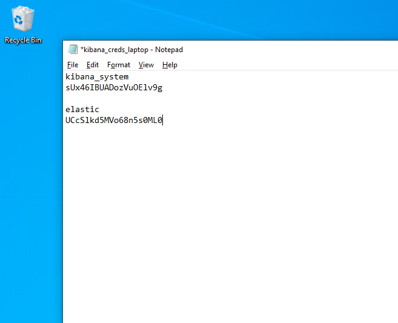

  *	Confirm your selection by inserting `y`

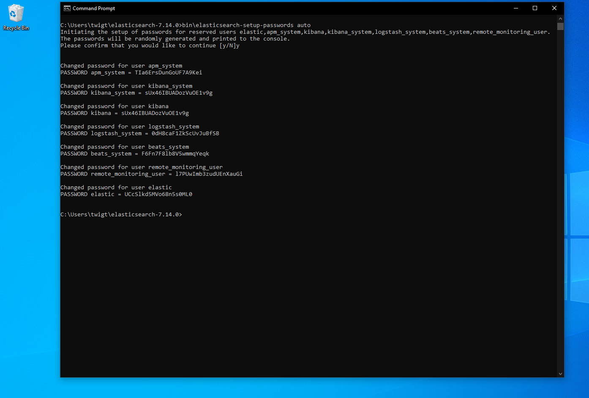

* We are going to need these login credentials, both the username and password, for the next step during configuring the security for Kibana.

As you can see, for the different roles/user names, passwords are created. Later in Kibana, we can access these user roles and changed the passwords if we would like to.

### Changing the security configuration in Kibana

To make the security settings effective for Kibana, we will add an additional setting to the Kibana configuration as well:

*	Open the configuration file of Kibana
*	The path to the configuration file of Kibana can be found in:
   * *Kibana-7.14.0-windows-x86-64 > config > kibana.yml*
   
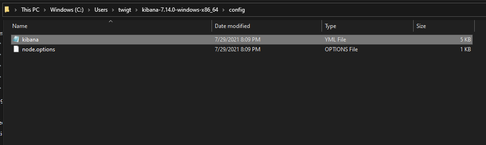

* Add the following setting
  * `elasticsearch.username: "kibana_system"`
  
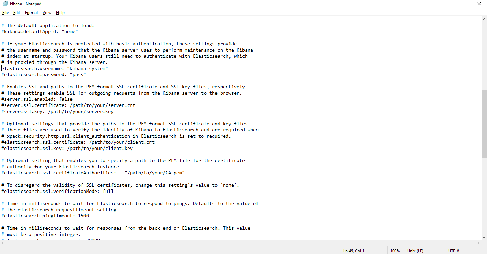

>	It could be that the name is already set to “kibana_username” in the configuration. In that case, also make sure this is changed to `kibana_system`. You only have to uncomment the line, which is done by removing # from the particular line.

(3) Open another, a third, Command Line in which we are going to start Kibana

*	Navigate to the Kibana directory and run the following command:
  *	`bin\kibana-keystore create`

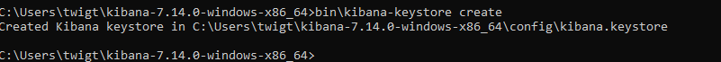

*	Next, we add the username to the keystore
  *	`bin\kibana-keystore add elasticsearch.password`
  *	We are now prompted to choose a password for our user `kibana_system`. You will not see this in the prompt, but this is what we have configured in the previous step.
* We will be prompted to insert the password. Here, we need to enter the password that is created for the kibana_system user in our previous step. Insert that password and press enter.
* The password is now saved in the keystore

Stop Kibana if it was still running:

*	Close the Browser tab with the Kibana interface open
*	Stop the process in the Command Prompt that is running Kibana

### Open Kibana with the new security settings

Make sure you close all the previous Command Line windows. It might be the case that a fresh Command Line window is required for the changes having effect.

Start Elasticsearch:

*	Open the Command Line
*	Navigate to the folder containing Elasticsearch
*	`bin\elasticsearch`

Start Kibana:

*	Open the Command Line
*	Navigate to the folder containing Kibana
*	`bin\kibana`

After Elasticsearch is started, let’s navigate to Elasticsearch:

*	[localhost:9200](localhost:9200)
*	We cannot access the cluster, since it is now protected:

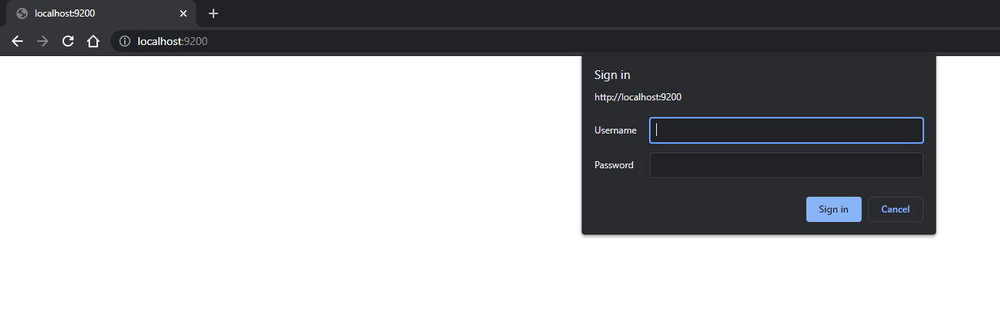

*	This is not a problem for now, we can leave it for now. We will be able to pick a username from the created Elasticsearch users in the settings that can be found in the Kibana interface
*	When Kibana is also fully started, navigate to the Kibana interface in the browser:
  * [localhost:5601](localhost:5601)
  
*	Also for Kibana, we are presented with the Login page. Insert the login credentials for the elastic the password

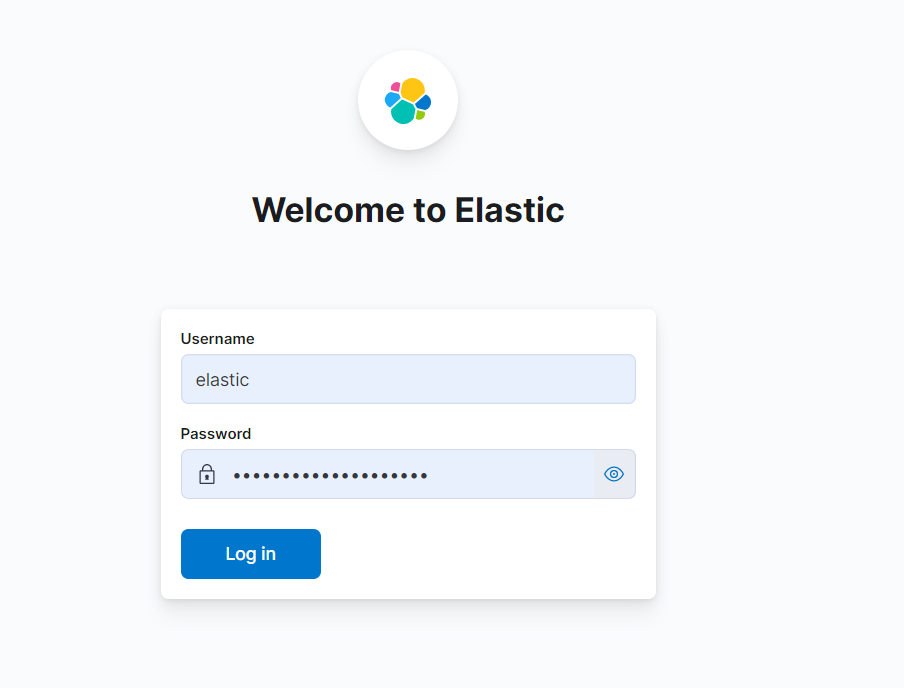

### Overview of the setup

Have enabled the basic security for our Elastic-cluster and Kibana interface. The kibana_system user is used to “log into” our Elasticsearch cluster. Therefore we needed to configure the kibana_system credentials. When Kibana is able to connect with our Elasticsearch cluster, we are able to use Kibana as an interface to our Elasticsearch cluster. Since the kibana_system username, which is reserved, is not able to use in our Kibana interface, we use our elastic username. This is the “master” account that we can use in Kibana to navigate through our Elasticsearch cluster. This user has enough rights to make major modifications to our Elasticsearch cluster.

### Get an overview of the users and change the password

Once we have logged in with our elastic user, we can get an overview of our current users. These are the users that are automatically created in the previous step.
In the sidebar menu of Kibana, select **Management > Stack Management**

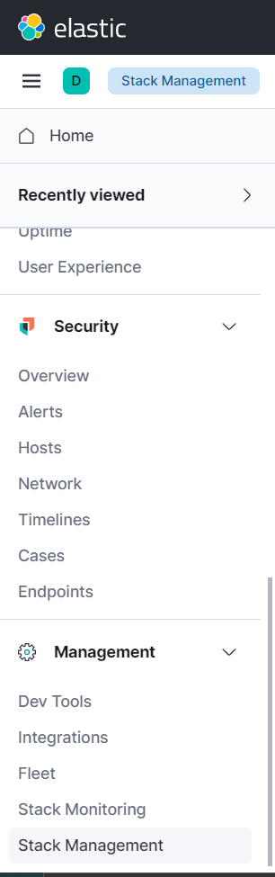

In Stack Management, select: **Security > Users**

On this page we can see all the, default, users that we have created. Notice the reserved label which indicated that the values of those usernames are reserved by Elasticsearch. We can add any other username except these reserved usernames.

On this page it is also possible to change permissions for specific usernames. It is also possible to change information of a certain username, for example the password. This is exactly what we are going to do for our elastic user:

*	In the page with usernames, select the `elastic` user. 
*	Select Change password

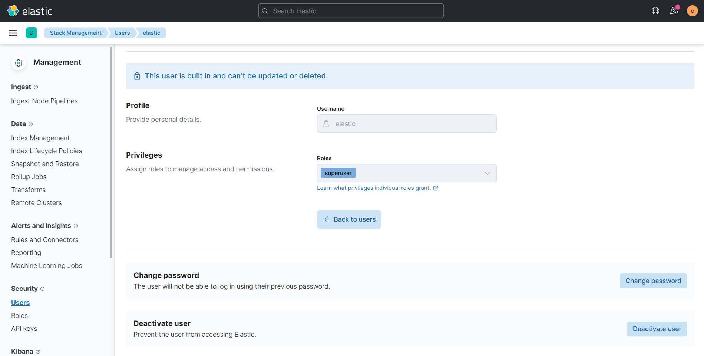

* Follow the instructions for changing the password, which involves inserting the old, current, password.
*	Choose a strong password you can remember. This way don’t need a separate file in which you have saved this password. This is quite sensitive information.
*	When you have changed the password, you will be able to login with the `elastic` user with your new password.

Now we have setup our basic security for Elasticsearch and Kibana and are able to login with our `elastic` user. We are going to use this user for all the operations during the labs.

