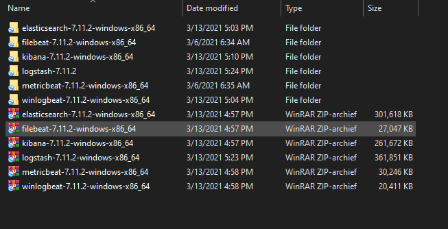
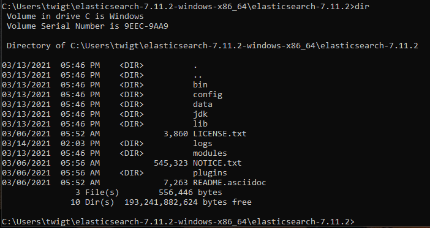
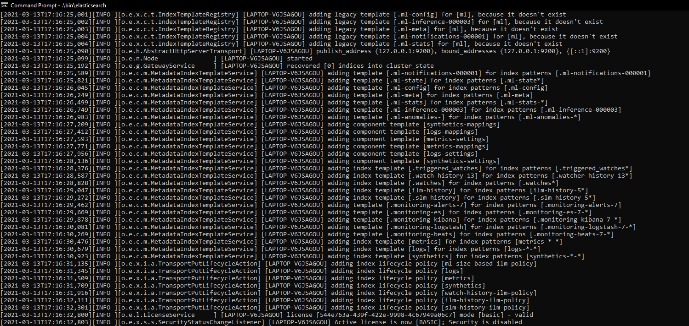
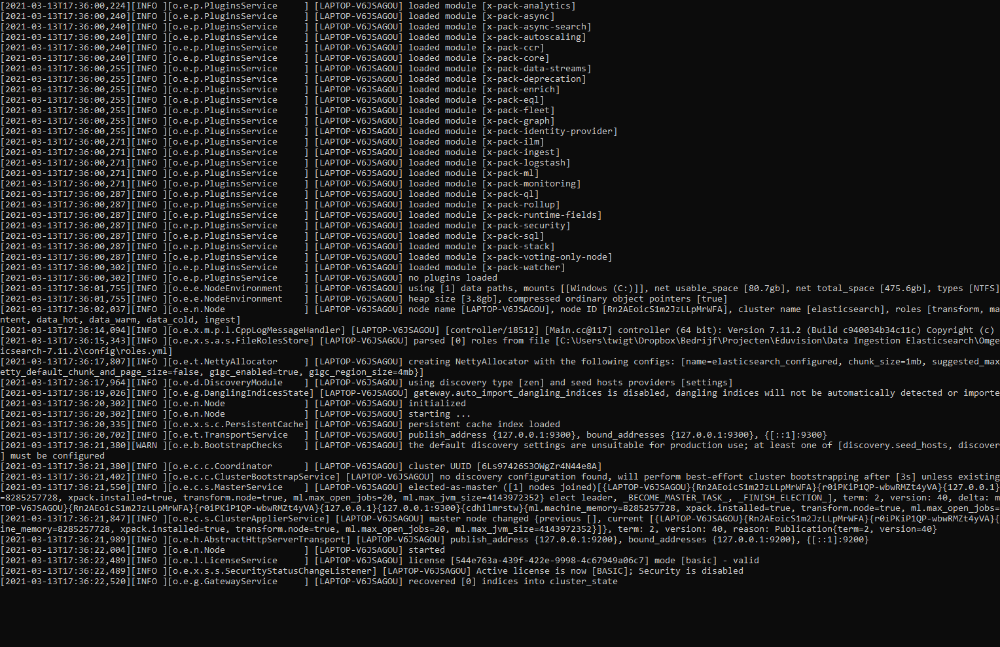
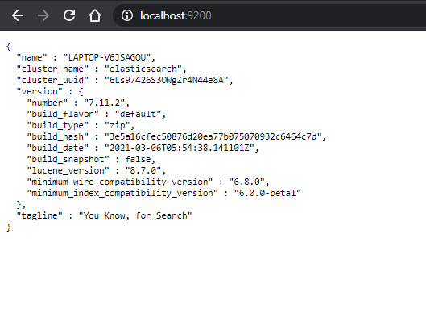
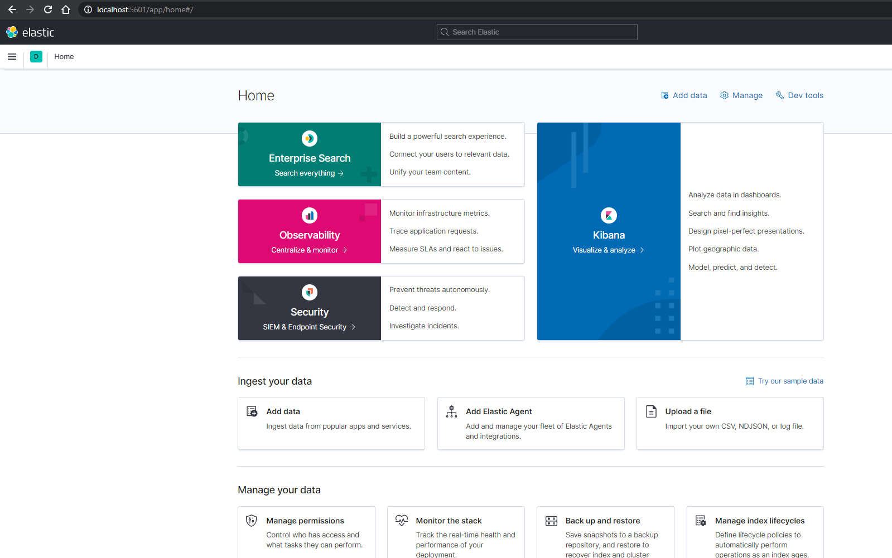

# Elasticsearch and Kibana


The goal of this chapter is to have our **Elasticsearch** instance up and running. Once we have started Elasticsearch we will be able to start **Kibana**. Most of our the labs will be executed using the Command Line (*CMD*, *Powershell*) and browsing through the interface in Kibana.


## Software.

### Download and extract the software in your Home Directory

Make sure we have downloaded the required software:

* [Elasticsearch](https://www.elastic.co/downloads/elasticsearch)
* [Kibana](https://www.elastic.co/downloads/kibana)
* [Logstash](https://www.elastic.co/downloads/past-releases/logstash-7-8-0) version ***7.8.0***
  * (Preferably Logstash version 7.11. However, this version has some issues. In that case, go for Logstash version 7.8.0)
* [Filebeat](https://www.elastic.co/downloads/beats/filebeat)
* [Metricbeat](https://www.elastic.co/downloads/beats/metricbeat)
* [Winlogbeat](https://www.elastic.co/downloads/beats/winlogbeat)

---

Make sure you save and extract the files in your *Home Directory*. This is the directory with your username that contains files like *Documents*, *Downloads*, *Pictures* etc. This directory is usually found in the path `My PC > Users > Arie` in which `Arie` is the name of my Home Directory.


> If you cannot see your Home Directory in your Explorer, enable Hidden Files


Unzip each file. You will end up with the following files. 





***Notes:***

> To keep your Home Directory tidy, you can delete the zip/tar files since we do not need those anymore.

> In case you have downloaded Logstash 7.8.0, which is advised for these labs, you will have a directory `logstash-7.8.0` instead of `logstash-7.11.2` as shown in this screenshot.


## Starting Elasticsearch from the Command Line


Since we will use Elasticsearch from our own computer, we need to start Elasticsearch manually. We will use the Command Line to execute the script that starts Elasticsearch. 


In Windows, from the **Start** menu, open a Command Line window. To find the Command Line we can insert "***CMD***".


Navigate to the directory in wich Elasticsearch is located:

```bat
cd elasticsearch-7.11.2-windows-x86_64/elasticsearch-7.11.2
```

Use the `dir` command to get an overview of the content contained in this directory. (`elasticsearch-7.11.2-windows-x86_64/elasticsearch-7.11.2`)

```bat
dir
```




> Note that in this case we passed through another folder to get to the current folder


## Start Elasticsearch


Good. From this point we get an overview of all the elements included in our Elasticsearch installation. For now, we are only interested in starting Elasticsearch. The Elasticsourc program, binary, is located in the `bin` folder. We can start Elasticsearch with the following command:

```bat
.\bin\elasticsearch
```

When Elasticsearch gets started, you will see a similar output as the following screenshot:



The output from starting Elasticsearch will continue for a little while. For now it is not necessary yet to inspect these output messages:



When the Elasticsearch stops generating output, when you see a message stating "Node started" (if you are able to find it), Elasticsearch is ready. 

A traditional way to find out if Elasticsearch is working, we can open our browser and navigate to `localhost:9200`.




Now that our Elasticsearch instance is running, we can start Kibana to get a visual interface for everything we want to in Elasticsearch.


# Start Kibana

Like all the other software in these labs, we will start Kibana from the Command Line. Open the a **New** Command Line window. We do not want to close our Command Line window that has Elasticsearch running. We cannot run Kibana if Elasticsearch is not running.

Open a new Command Line window and navigate to the directory containing Kibana.

```bat
cd kibana-7.11.2-windows-x86_64
```

Start Kibana just like we have started Elasticsearch in the previous steps:

```bat
.\bin\kibana
```

Just like Elasticsearch, Kibana needs some time to boot. You will see messages indicating that it will look for a running Elasticsearch instance. Based on that, it will return messages like "Yellow" and "Green" which indicates we are ready to use Kibana.

While Elasticsearch default runs in port `9200`, Kibana runs in port `5601`. Open a new browser tab and navigate to `localhost:5601`. The homepage of Kibana will be displayed.




