# Metricbeat


In the previous lab we have started Elasticsearch and Kibana. In this lab we will setup Metricbeat to send logs of our System  to Elasticsearch. When the log files are indexed in Elasticsearch, we can visualize these logs in a Dashboard using Kibana. 

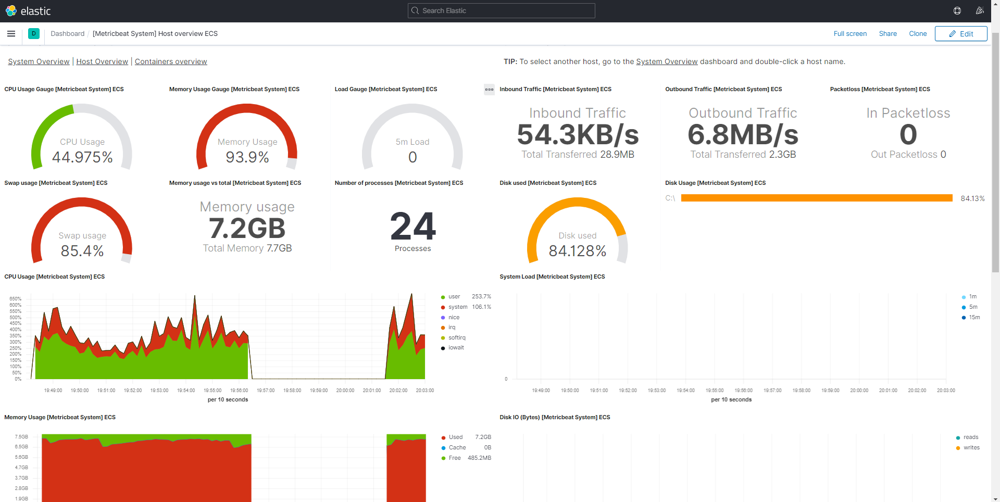


## Setup Metricbeat for the first time

When we use Metricbeat for the first time, it needs an initial setup. The setup is specified in a Powershell script called `install-service-metricbeat.ps1`. We will walk through the steps to install and run metricbeat.

Since the initial setup file is a Powershell script, we need to use Powershell instead of the Command Line this time to execute this script. We need to open Powershell as an Administrator in order to have the right permissions for executing scrips. 

Open Powershell as Administrator:

* Right-click
* `Run as Administrator`

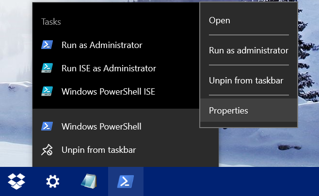


Navigate to the directory containing Metricbeat:

```bat
cd metricbeat-7.11.2-windows-x86_64\
```

We can use the `dir` command to get an overview of the files and folders of the current directory:


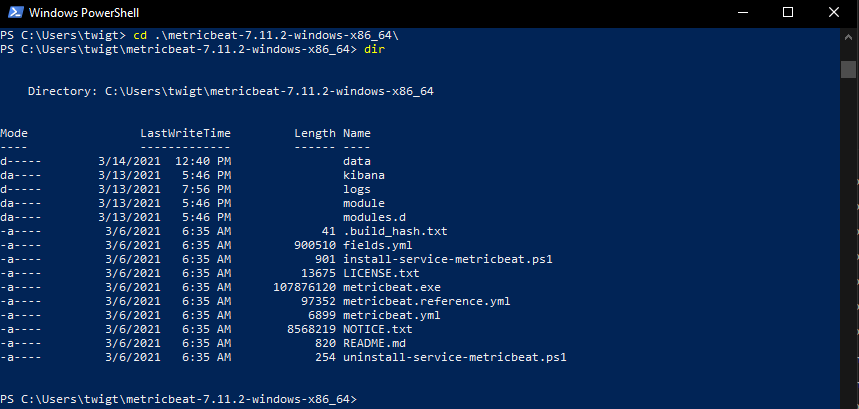


If you want to run Metricbeat for the first time, we need to execute the installation script `install-service-metricbeat.ps1`. Let's execute this script.

```bat
.\install-service-metricbeat.ps1
```

It is possible you will get an error message "Authorization error". This is a safety measure which prevents, malicious, scripts from running on our system. We need to lift this restriction for a bit in order to setup Metricbeat:

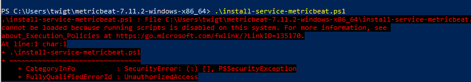


```bat
Set-ExecutionPolicy RemoteSigned

.\install-service-metricbeat.ps1

Set-ExecutionPolicy Restricted
```

When the Powershell script is finished, execute the initial setup:

```bat
.\metricbeat.exe modules enable system
```

Next step:

```bat
./metricbeat setup
```

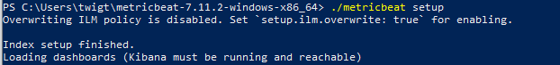

The final step, is ofcourse to start Metric beat. From the moment we start Metricbeat, it will look for System logs in our computer and send those to Elasticsearch to be indexed. To start Metricbeat, run the following command:

```bat
./metricbeat -e 
```

If we wait for a little while, we will see some log lines with metrics showing up:

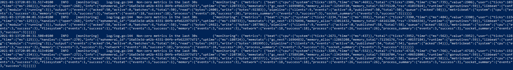

## Check out the Metrics Dashboard

Now the setup is complete, we will start Metric beat. Metricbeat will find the System Logs on our laptop and index these to Elasticsearch.

Let's move to kibana to get an overview of the data in our Elasticsearch indices. In the Kibana menu select **Dev Tools**. This will bring us to the editor in which we can execute Elasticsearch requests. 

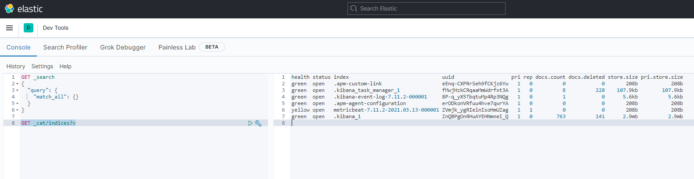

To get an overview of our currnet indices, we can use the following Elasticsearch request:

```json
GET _cat/indices?v
```


## Enable the Metrics Dashboard in Kibana


Select `Add data` in the header **Ingest your data**


When we finished the initial setup of Metricbeat, look it up in one of the  many types of pre-configured log configurations. 


Select `System metrics`


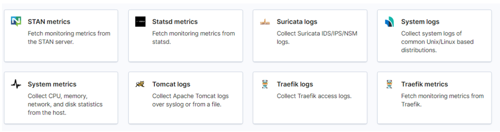


Since we already executed the steps (Step 1 - Step 4) as specified on the page, we can proceed by selecting `System metrics dashboard`

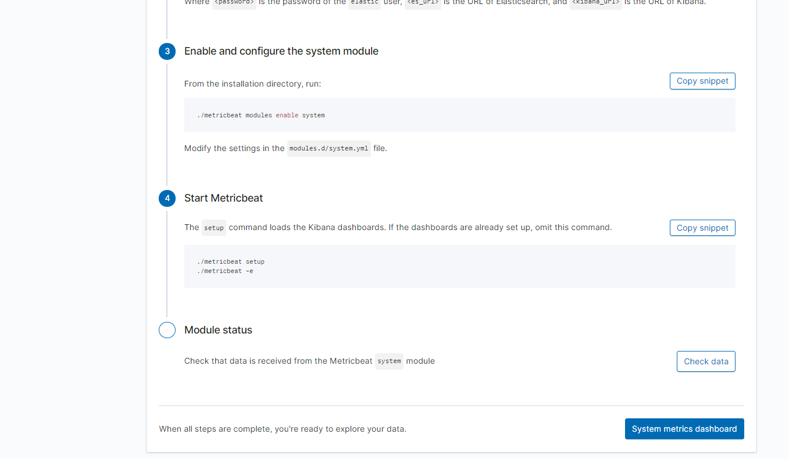


## Specify Index Patterns


Before we can checkout our Metrics dashboard, we need to specify an `Index Pattern`. This will map an Elasticsearch index to a pattern that we can access to display in our visualisations and dashboards in Elasticsearch.

Open **Stack Management** in de Kibana Menu

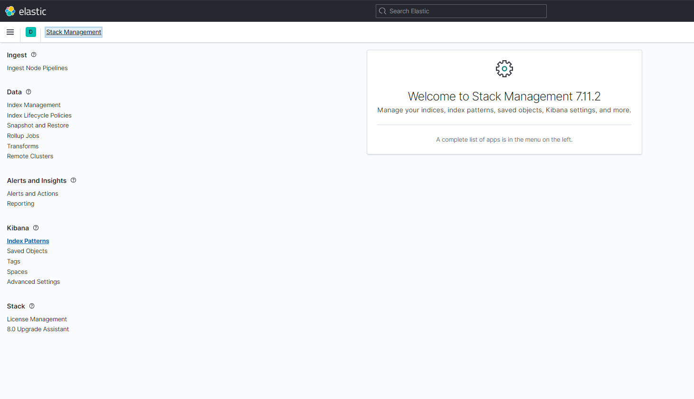

This will open the Stack Management menu. Select **Index Patterns** in the menu on the left.

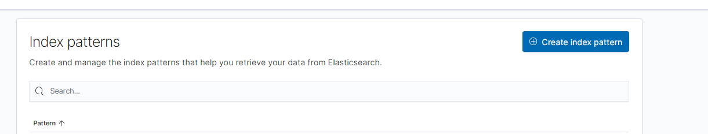

Let's create an Index Pattern for Metricbeat. Insert `metric beat` in the *"index pattern name"* field.

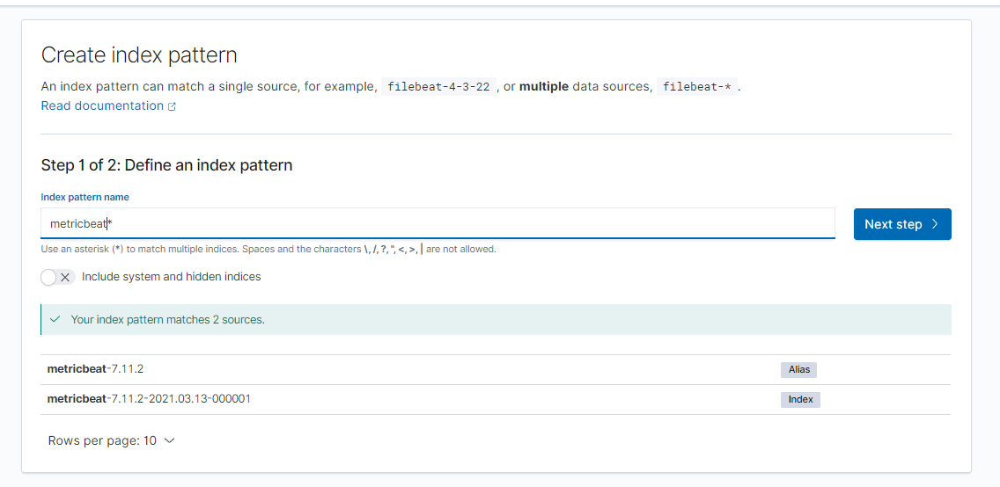


Choose which field is used as the timestamp in our current source of log files. We will select the `@timestamp` field for this:

[Select timestamp](img/screenshot_index_pattern_step_2_timestamp.PNG)


We get an overview of our succesfully created Index Pattern. 

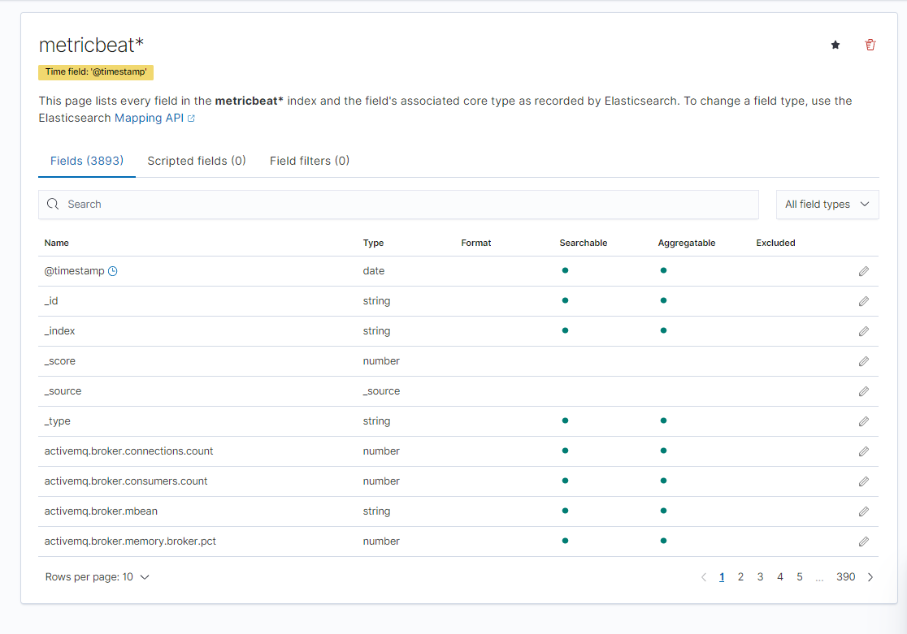


## Checkout our Metrics 


Strangely we do not see any data yet.

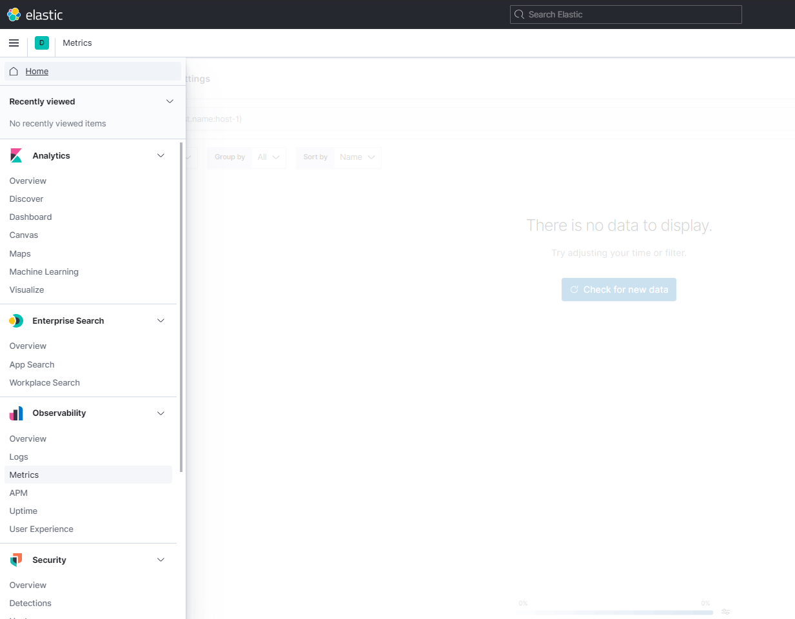

Let's hit `Refresh` button on the right.

Metricbeat is continously pushing log-data to Elasticsearch. The Auto Refresh of Kibana will update the visualisations to display the new data.

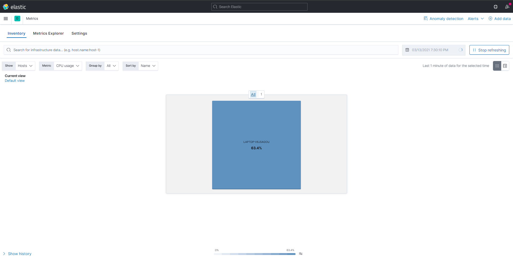


Other than refreshing for the latest logs, we can also specify a specific data range:

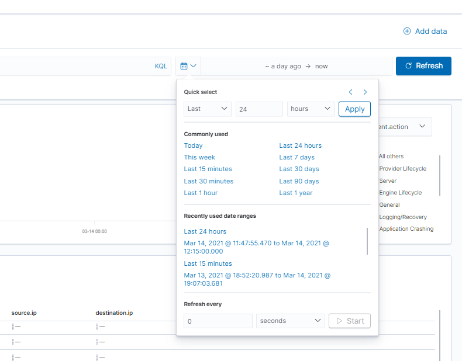

Go ahead and explor some different metrics:

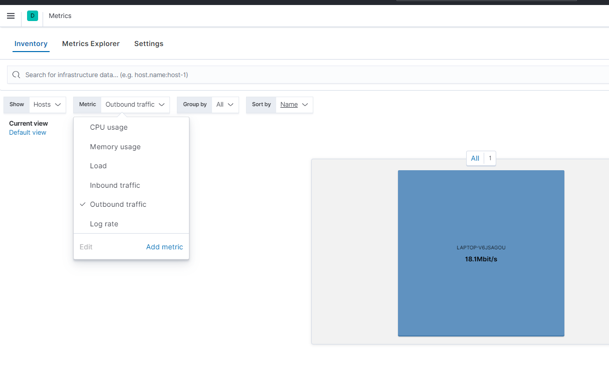


## Check out our Metrics in the Dashboard

Let's checkout the Dashboard to get a nice overview of all the Metrics displayed in our dashboard.


## Metrics in Dashboard

Select **Dashboard** in the Kibana menu. Insert Metricbeat System in the search bar. Select the dashboard **[Metricbeat System] Overview ECS**. This is a pre-configured dashboard which is created during our setup of Metricbeat. As you can see, there are other pre-configured dashboards for different purposes. In our case, we can only use dashboards related to System Metrics since logs of our system are the only type of data we currently have in our Elasticsearch index.

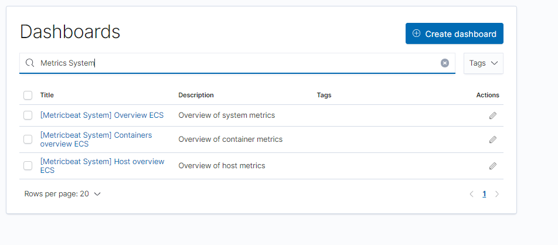


We get an overview of all the systems for which we enabled Metricbeat to log metrics from. In our case this is one system/host, our own computer.

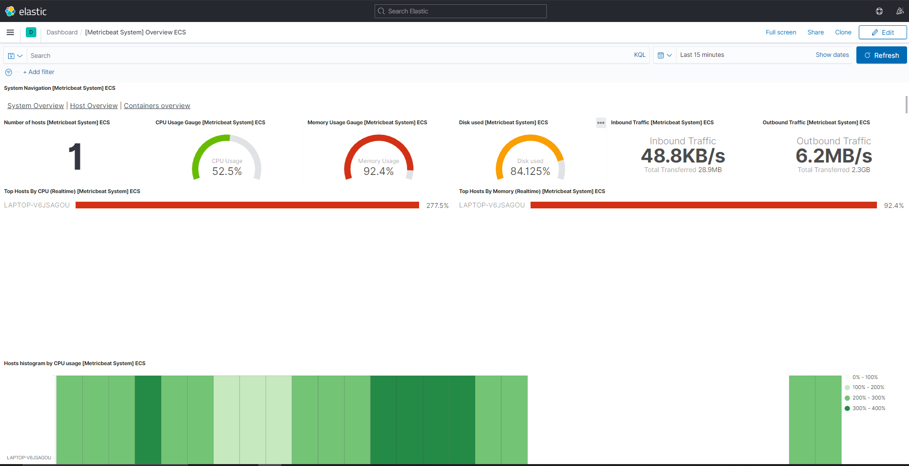


We can deep dive into the metrics of this system by selecting Host


## Metrics in Discover

Select **Discover** in the Kibana menu.

In Discover, we can execute KQL queries for exploring, aggregating or filtering our data. We will do this in **Lab 6**.

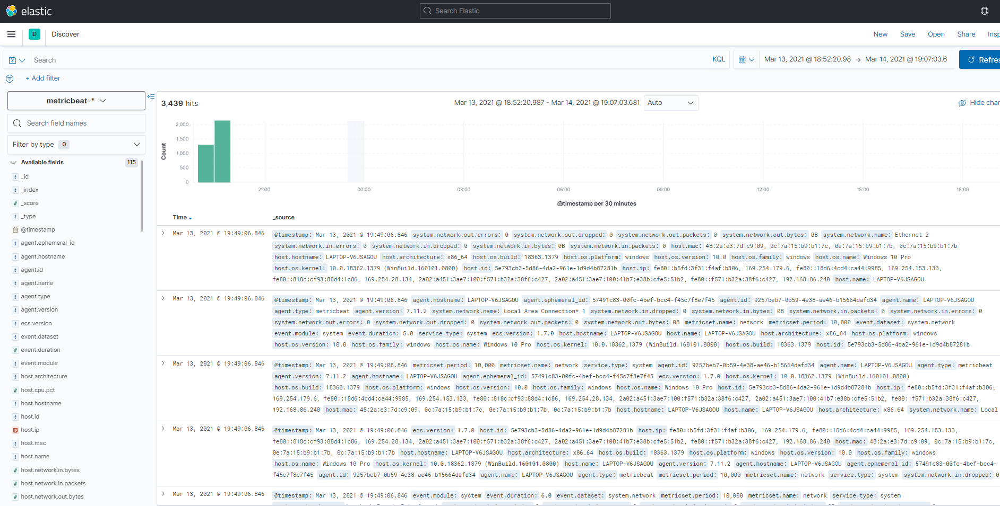


## Conclusion


That's it for now.
De eerstvolgende keer dat je metricbeat wilt gebruiken, hoef je niet meer het configuratie-script voor powershell te openen

Je het dan gewoon via het Command Prompt doen. 


