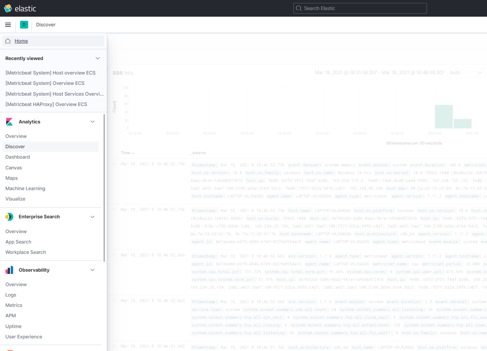
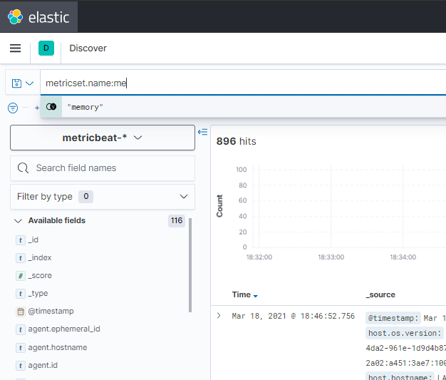
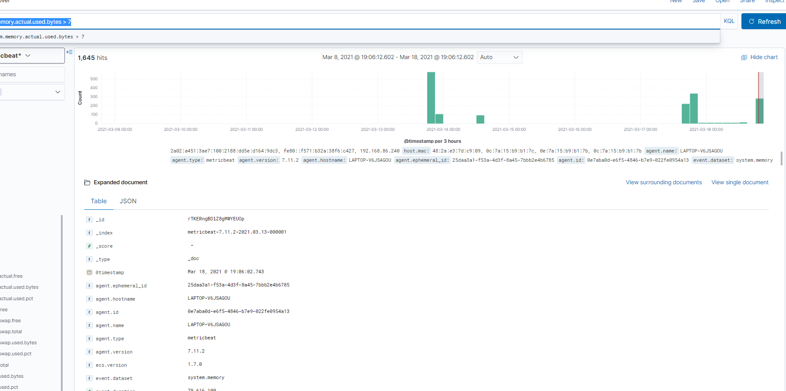
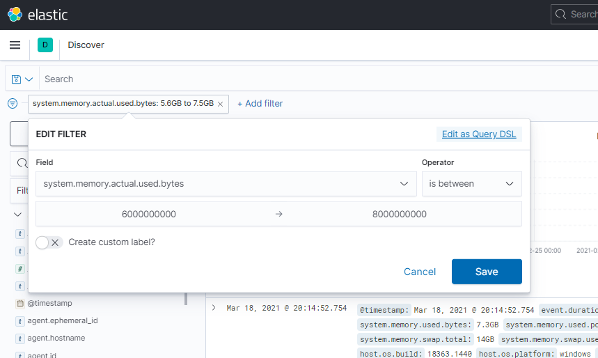
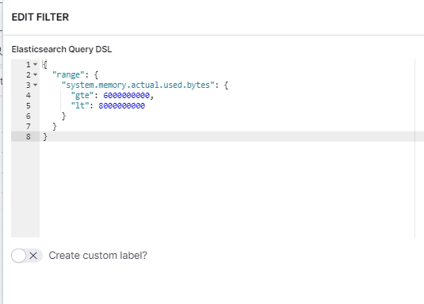
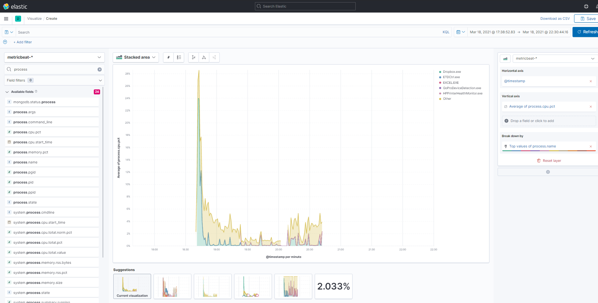

# Visualisation

In this lab we are going to analyse and visualise the metrix from our `metrixbeat*` index. Make sure we have metricbeat running to make sure new log data with metrics will keep flowing in.

## Analyze

First let's start analyzing our log data. In the Kibana menu open **Discover**.

We are going experiment with some filters in the Kibana Query Language `KQL`.

Insert `metricset.name:memory`

The log lines will be filtered 

Also try a numeric filter like:

`system.memory.actual.used.bytes > 7`

This is actually 7 bites...

No try 4 Gigabytes:

`system.memory.actual.used.bytes > 600000000`

We can expand one of the log lines check out all the fields of the line.

We can easily work with ranges:

We can also inspect the Elasticsearch query behind this filter:

## Visualisation

We have several options in Kibana to create a visualisation of our data. In the Kibana menu, select **Visualize**. 
In the top right corner, select **Create visualization**.

Select the option **Lens**. This is an editor in which we can easily drag and drop fields at the axes of our visualisation.

Choose "Area chart" as option.

Put the following fields on the axes:

* Horizontal axis: `@timestamp`
* Vertical axis: `process.cpu.pct`
* Break down by: `process.name`

Save this visualisation as we can use it later for our dashboard.

