# Winlogbeat

In this lab we will display Windows logs in our Kibana dashboard. The end results will look similar to the following screenshot:

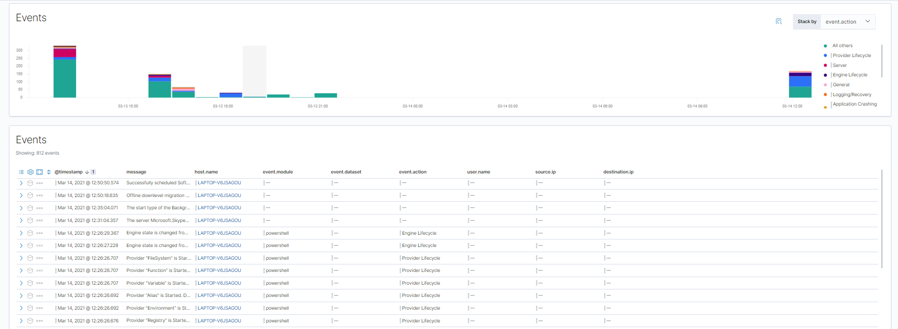


## Setup Winlogbeat

Just like in the labs for Elasticsearch, Kibana and Metricbeat, also Winlogbeat will be started from the Command Line. Make sure Elasticsearch and Kibana are running, both in their seperate Command Line sessions. Open a new Command Line and navigate to the directory where Winlogbeat is located.


```bat
cd winlogbeat-7.11.2-windows-x86_64
cd winlogbeat-7.11.2-windows-x86_64
```

> In my case, the main files of Winlogbeat are located in another folder called `winlogbeat-7.11.2-windows-x86_64`. Therefore the two similar commands.


Use the `dir` command to get an overview of the files and folders in the main directory of Winlogbeat. 

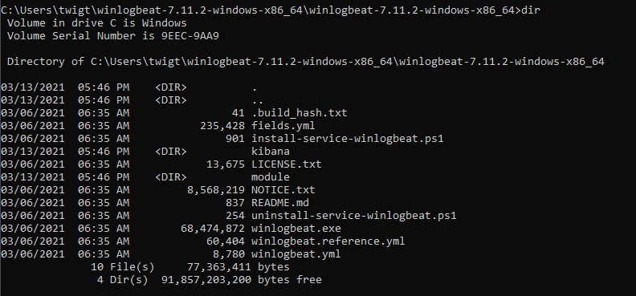


Just like Metricbeat, we need to setup Winlogbeat if this is the first time we use this version on the computer.

```bat
winlogbeat setup
```

Just like the setup of Metricbeat, the setup of Windows may take a little while.

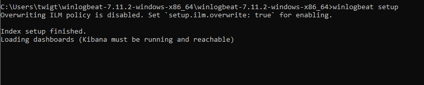


When the setup is finished, we can start Winlogbeat:

```bat
winlogbeat
```

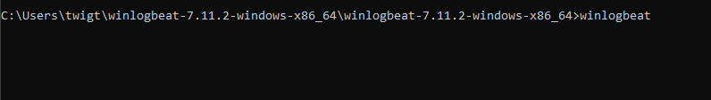


No that we have started Winlogbeat, we want to initiate our dashboard for Windows logs in Kibana.


## Initiate the Windows logs dashboard in Kibana


From the homescreen of Kibana, select the option **Add data**


From the list of pre-configured options select **Windows Event Log**

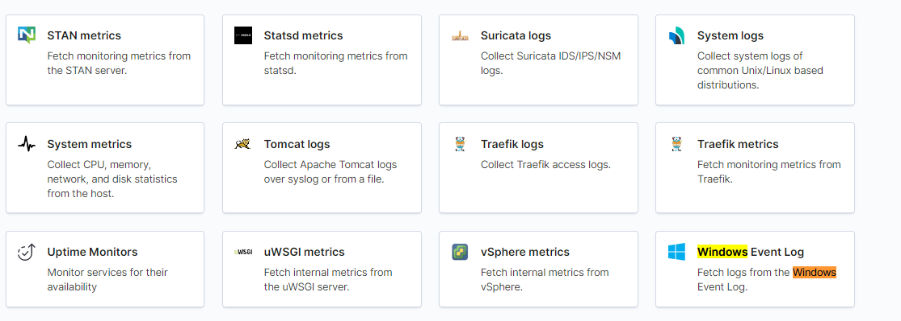


Since we already executed the options for the (initial) setup of Winlogbeat, we can ignore the steps descbribed. 

We can verify if Elasticsearch has already received some data of our running Winlogbeat instance in the Command Line. Select the button **Check data** to let Kibana check if we already have some data.

We get a message if Elasticsearch has succesfully received our data.


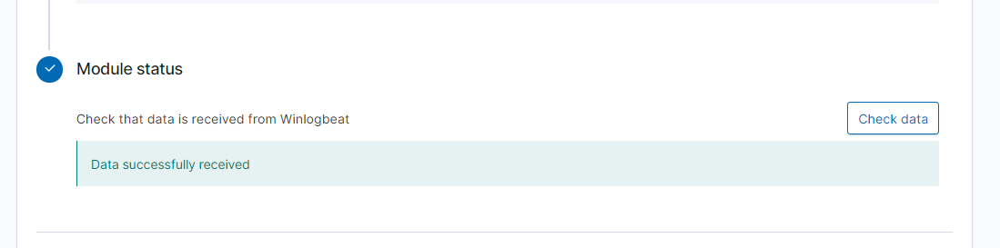


Next click the **SIEM app** button to explore our data.

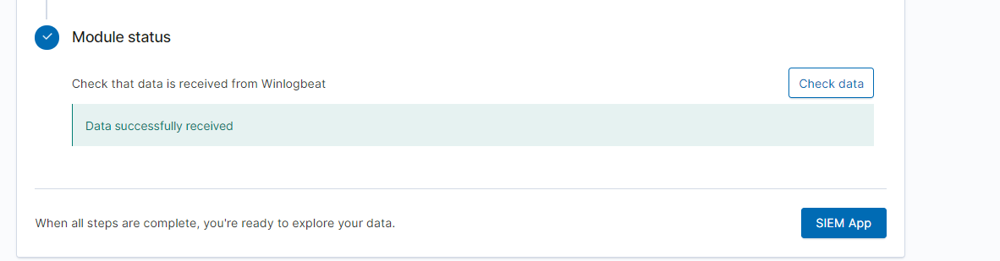


Congratulations, we are now presented with our Windows logs files in the dashboard. Make sure the filters are properly set. You can also scroll down the page in order to view all the visualisations.

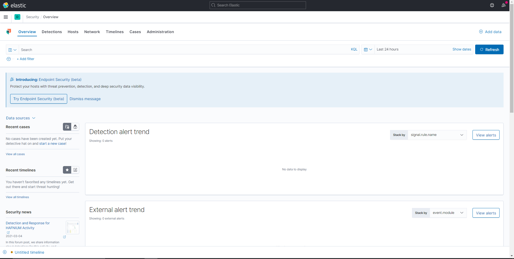
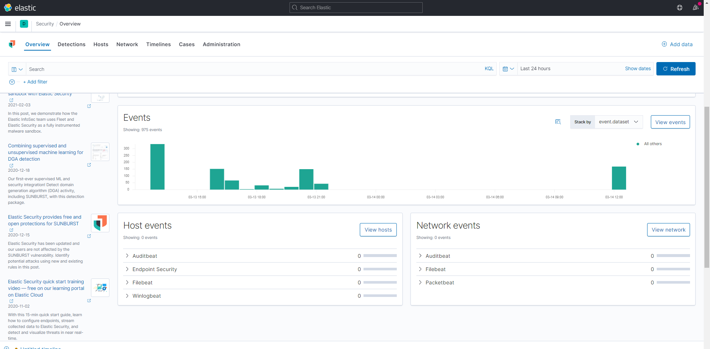


When we drill down the different visualisations we also get different tables that show our Windows logs.


## Check out the Windows logs in the Elasticsearch index

Let's checkout the raw Windows logs in our Elasticsearch index. In the Kibana menu, navigate to Dev Tools.

In the Editor, execute the Elasticsearch request to get an overview of our current indices.


```json
GET _cat/indices?v
```

The list with indices contains an index staring with `winlogbeat` (followed by the timestamp of the initation of the Winlogbeat instance).


Let's checkout what a Window log line indexed in Elasticsearch looks like

```json
GET winlogbeat-*/_search
{
  "query": {
    "match_all": {}
  }
}
```

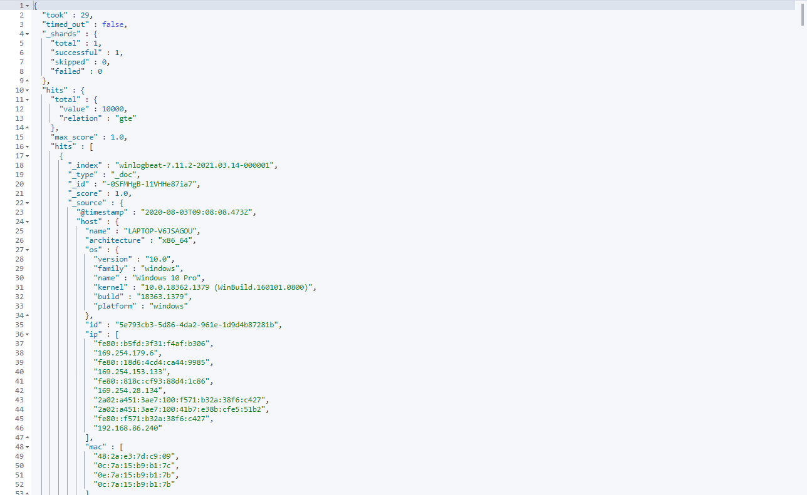


The `_source` field contains the original Windows log line.

 
## Index Patterns en Discover


Just like Metricbeat, we have the possiblity to discover the Windows logs provided by Windlogbeat. This requires us to also define an Index Pattern for our `winlogbeat` index. In [see above](##specify-index-patterns) we can recall these steps.


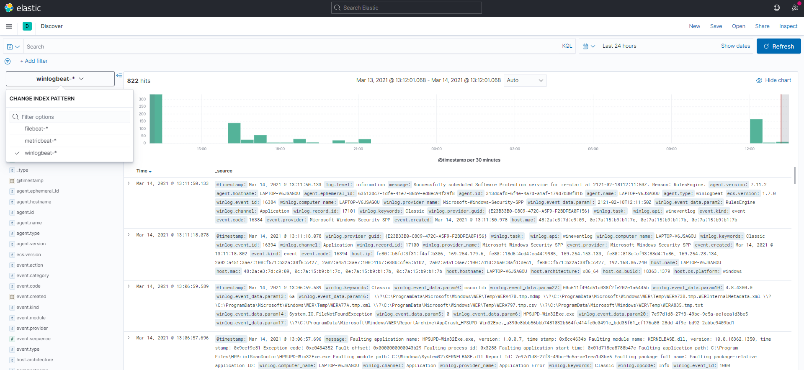


