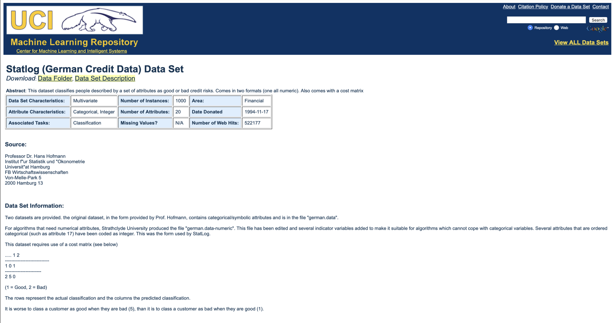
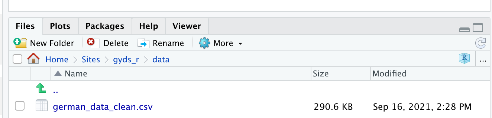
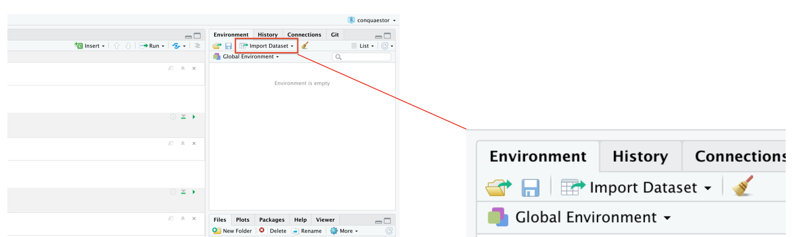
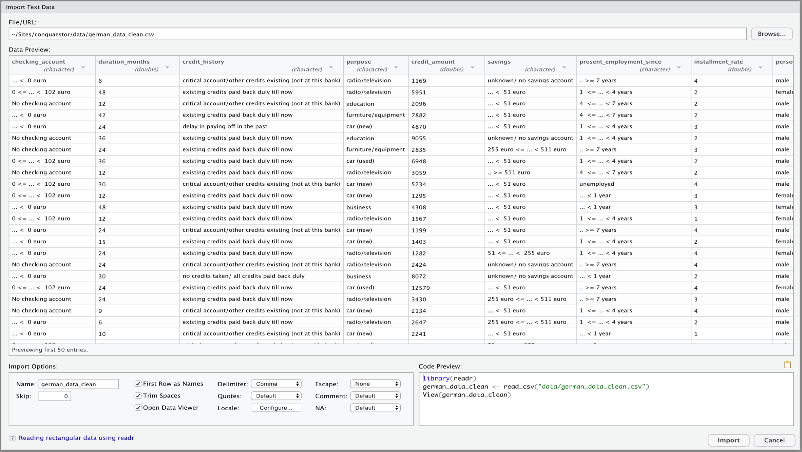

# Working with Data Frames in R


## The example dataset


The `data.frame` structure in R is the main data structure for storing and analyzing data. For example, when a csv-file is imported into the R session, it becomes a data frame.


To explore how to work with data frames in R, we will use a dataset that is widely used for different statistical experimens. This dataset is called the **German Credit Data** dataset.


We can import this dataset from:

https://archive.ics.uci.edu/ml/datasets/statlog+(german+credit+data)




In the example this dataset is saved as "german_data_clean.csv" in our working directory. To keep your project tidy, you might consider creating an extra folder in which you want to store all your datasets. In this example project we have created a directory called `data`:





## Importing data with RStudio


In RStudio, it is easy to import a csv dataset into our current R session:




RStudio shows us a preview of the dataset we select to open:




Opening the dataset in R will generate the R code that is needed to import the dataset in the R-session:

```{r}
library(readr)
german_data_clean <- read_csv("data/german_data_clean.csv")

View(german_data_clean)
```

> Note that you do not have to type in this code yourself, this code is automatically generated when we import our dataset with the **Import Dataset** button in RStudio.


## Exploring data frames in R


Now the dataset is imported as a data frame in R, we can use many functions of R to select or modify this dataset.

For our convenience, we will rename the dataset for now:

```{r}
data <- german_data_clean
rm(german_data_clean)
```


Showing the dimensions of the data frame

```{r}
dim(data)
```


Number of rows of the data frame

```{r}
nrow(data)
```


Number of columns of the data frame

```{r}
ncol(data)
```


Column names of the data frame


```{r}
names(data)
```


Informative description of the data frame


```{r}
str(data)
```


Selecting a column of the data frame


```{r}
data$credit_amount
```

An alternative for selecting a column of a data frame:


```{r}
data["credit_amount"]
```


Providing a summary of a variable:


```{r}
summary(data$credit_amount)
```

Providing a summary of the entire data frame

```{r}
summary(data)
```


Getting the maximum value of a variable


```{r}
max(data$credit_amount)
```


In some cases `character` variables of the data frame can be better described in combination with the `factor` function.

```{r}
# not a useful description
summary(data$telephone)
```

```{r}
# better
summary(factor(data$property))
```

### Selecting rows and columns in a data frame


Selecting rows

```{r}
data[3:10,]
```


Selecting columns

```{r}
data[,4]
```


Selecting multiple rows

```{r}
# rij 5 t/m 10 selecteren
data[5:10, ]
```

Selecting row 5 to 10 and column 9 to 11 

```{r}
data[5:10, c('purpose', 'age_years')]
```

Selecting row 1, 3, 5, 7 and column  2, 4, 6, 8:

```{r}
data[c(1,3,5,7), c(2,4,6,8)]
```


### Filtering data frames


Loans with a minimal `duration` of 20 (months)

```{r}
data[data$duration_months >= 20, ]
```


Filter for single males

```{r}
# first, checkout what the values look like that we would like to filter
unique(data$personal_status_sex)
```

```{r}
single_males <- data[data$personal_status_sex == "male   : single", ]
```

Displaying the data

```{r}
single_males 
```


Apply multiple filters

```{r}
data[data$personal_status_sex == "male   : single" & data$age_years > 60 , ]
```


Creating calculated columns with the `ifelse()` function:

```{r}
data$duration_type <- ifelse(data$duration_months <= 12, "short", "long")
```

Show the values of the newly created column

```{r}
summary(factor(data$duration_type))
```

Categorieen maken met nested

```{r}
data$age_class <- cut(data$age_years, breaks = c(18, 25, 50, 65, 100), labels=c("young", "adult", "senior", "retired"))
```

```{r}
data$age_class <- cut(data$age_years, 
                      breaks = c(18, 25, 50, 65, 100),
                      labels=c("young", "adult", "senior", "retired"))
```

Check the categories:

```{r}
summary.factor(data$age_class)
```

```{r}
table(data$age_class)
```


## Data exploration with basic R visualisations

```{r}
counts <- table(data$age_class)

barplot(counts, main="Loans by age class", 
   xlab="Age class")
```

```{r}
numbers <- c(1,2,3,4,5)
barplot(numbers)
```

Additional markup options for the visualisation:

```{r}
barplot(counts, width = 3,
        space = 0,
        col = "blue", 
        main = "Number of loans by Age Class", 
        xlab = "Age class", 
        ylab = "Aantal")
```


A simple scatter plot

```{r}
plot(data$credit_amount, type = "l", lwd = "4", col= "#000000", main = "Credit amount")
```

Boxplot

```{r}
boxplot(data$credit_amount, notch = TRUE,
        col = "red",
        names = "Credit amount")
```

Creating a boxplot **without** outliers

```{r}
boxplot(data$credit_amount, notch = TRUE,
        col = "red",
        names = "Credit amount",
        outline = FALSE)
```

Creating a pie chart

```{r}
pie(counts)
```


```{r}
pie(counts, labels = names(counts), main="Age class")
```

```{r}
pie(counts, 
    labels = names(counts),                           
    main="Loans by age class",                        
    col = c("lightblue", "blue", "darkblue", "gray"), 
    sub = "Source: Loan research 2019: Arie Twigt")   
```


Histogram

```{r}
hist(data$credit_amount)
```

```{r}
hist(data$credit_amount, breaks = 5)
```


Plotting the distribution of a variable:

```{r}
plot(density(data$credit_amount))
```


